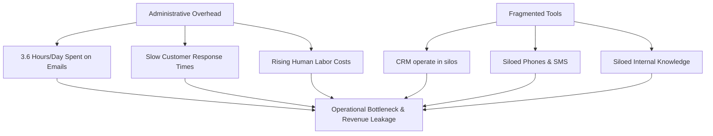
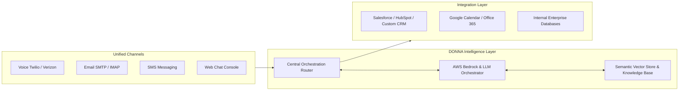
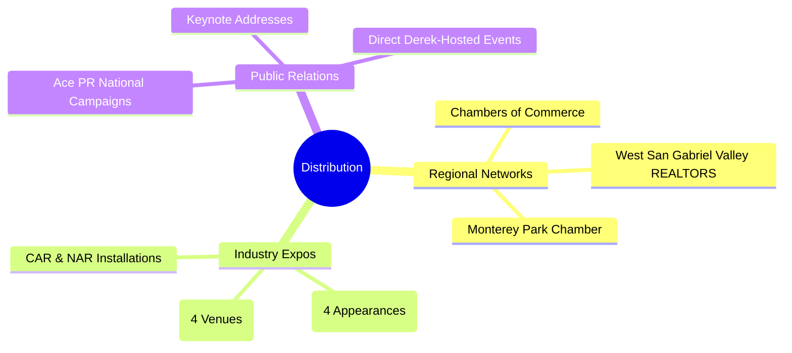
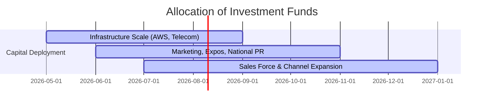

# DONNA: Operational Intelligence Infrastructure for Modern Business
### Investor Presentation & Pitch Deck
*Digital Operations Neural Network Assistant (DONNA)*

---

## 📋 Table of Contents
1. [The Title & Vision](#slide-1--title--vision)
2. [The Problem: The Operational Friction Crisis](#slide-2--problem--the-operational-friction-crisis)
3. [The Opportunity: The Underserved Middle Market](#slide-3--opportunity--the-underserved-middle-market)
4. [What is DONNA?](#slide-4--what-is-donna)
5. [Capability 1: Meeting & Knowledge Orchestration](#slide-5--capability-1--meeting--knowledge-orchestration)
6. [Capability 2: Context-Aware Email Coordination](#slide-6--capability-2--context-aware-email-coordination)
7. [Capability 3: Real-Time Conversational Voice Interface](#slide-7--capability-3--real-time-conversational-voice-interface)
8. [Capability 4: Conversational Web Intelligence](#slide-8--capability-4--conversational-web-intelligence)
9. [Technical Architecture & Moat](#slide-9--technical-architecture--moat)
10. [Commercial Tiers & Pricing Architecture](#slide-10--commercial-tiers--pricing-architecture)
11. [Unit Economics & Gross Margin Profile](#slide-11--unit-economics--gross-margin-profile)
12. [Scalability & User Acquisition Velocity](#slide-12--scalability--user-acquisition-velocity)
13. [Go-To-Market Strategy](#slide-13--go-to-market-strategy)
14. [Competitive Landscape](#slide-14--competitive-landscape)
15. [Diversified Business Model](#slide-15--diversified-business-model)
16. [SAFE Investment Tiers](#slide-16--safe-investment-tiers)
17. [Asymmetric Return Scenarios](#slide-17--asymmetric-return-scenarios)
18. [Strategic Milestones & Horizon Plan](#slide-18--strategic-milestones--horizon-plan)
19. [The Investment Thesis & Closing](#slide-19--the-investment-thesis--closing)

---

## Slide 1 — Title & Vision

<div align="center">
  <br />
  <h1>D O N N A</h1>
  <p><strong>Digital Operations Neural Network Assistant</strong></p>
  <p><em>The Operational Intelligence Layer for Modern Business</em></p>
  <br />
</div>

> [!NOTE]
> **Vision Statement:**
> DONNA is an institutional-grade, multi-channel operational AI platform built on native AWS infrastructure. It is designed to help small and mid-sized businesses (SMBs) seamlessly coordinate communication, automate workflows, centralize knowledge, and elevate operational intelligence across teams and systems.

- **Centralized Coordination:** Unifies voice, email, SMS, and knowledge bases.
- **Telecom-Grade Infrastructure:** Powered by AWS Bedrock, Twilio, and Verizon VOIP pathways.
- **Designed for Scale:** Engineered specifically to alleviate operational friction in communication-heavy industries.

---

## Slide 2 — Problem — The Operational Friction Crisis

Small and mid-sized businesses are drowning in administrative complexity and fragmented workflows.



### Key Pain Points:
1. **Administrative Overhead:** Operators spend over 3.5 hours per day on routine, repetitive asynchronous communication.
2. **Revenue Leakage:** Slow customer response times directly translate to lost leads and churned opportunities.
3. **Severe Tool Fragmentation:** CRMs, email accounts, VOIP phone systems, and SMS channels exist in isolated silos.
4. **The Automation Deficit:** No existing SMB solution combines low-latency voice, email intelligence, meeting orchestration, and structured knowledge retrieval in a single, cohesive, cost-effective platform.

---

## Slide 3 — Opportunity — The Underserved Middle Market

The B2B SaaS ecosystem has left a massive gap between complex, high-cost enterprise automation tools and simplistic, single-feature consumer widgets.

> [!IMPORTANT]
> **Horizontal Reach + Vertical Specialization**
> While horizontal in capability, DONNA is vertically tailored to capture high-density, communication-heavy SMB segments that face massive daily operational strain.

### Core Target Verticals:
* **Real Estate & Property Management:** Rapid lead response, tenant coordination, and scheduling.
* **Hospitality & Booking-Heavy Businesses:** Round-the-clock guest inquiries, booking confirmations, and requests.
* **Professional Services & Insurance:** Client follow-ups, policy information access, and appointment scheduling.
* **Chambers of Commerce & Trade Associations:** Centralized member inquiries, event logistics, and community coordination.

---

## Slide 4 — What is DONNA?

DONNA is a centralized operational intelligence layer that bridges the gap between teams, systems, and customers.

```
       ┌────────────────────────────────────────────────────────┐
       │                 CUSTOMERS & CHANNELS                   │
       │        [Voice]   [Email]   [Web Chat]   [SMS]          │
       └───────────────────────────┬────────────────────────────┘
                                   │
                                   ▼
       ┌────────────────────────────────────────────────────────┐
       │                     D O N N A                          │
       │            Unified Operational AI Layer                │
       ├────────────────────────────────────────────────────────┤
       │  • Real-Time Transcription   • Semantic SOP Retrieval  │
       │  • Multi-Turn Reasoning       • CRM State Sync         │
       └───────────────────────────┬────────────────────────────┘
                                   │
                                   ▼
       ┌────────────────────────────────────────────────────────┐
       │                  ENTERPRISE SYSTEMS                    │
       │     [Internal Databases]   [CRMs]   [Scheduling Engines]│
       └────────────────────────────────────────────────────────┘
```

- **Not a Simple Chatbot:** An active operational coordinator executing processes across multiple communication streams simultaneously.
- **Human-in-the-Loop Safeguards:** Fully configurable to act autonomously or generate structured drafts for operator review.
- **Clinical & Consistent:** Maintains perfect brand consistency, data accuracy, and professional standard operating procedures (SOPs).

---

## Slide 5 — Capability 1 — Meeting & Knowledge Orchestration

### Administrative Coordination Engine

DONNA attends meetings, ingests unstructured discussions, and translates them into structured business data.

```
[Meeting Audio Stream] ──► [Whisper Transcription] ──► [SOP & Knowledge Matching] ──► [Structured Actions & Follow-ups]
```

* **In-Meeting Assistance:** Automatically transcribe, summarize, and extract key action items.
* **Active Knowledge Retrieval:** Connects directly to internal SOPs, documentation, and database files to provide instant, verified answers during and after client interactions.
* **Asynchronous Execution:** Instantly drafts recap emails, creates tasks inside task management platforms, and schedules calendar events based on natural conversations.

---

## Slide 6 — Capability 2 — Context-Aware Email Coordination

### Asynchronous Communication Engine

DONNA acts as a highly intelligent email communication assistant, handling heavy inbound and outbound volumes with deep context tracking.

> [!TIP]
> **Sophisticated Context Retention**
> Unlike standard auto-replies, DONNA reads full, multi-party email threads, understands historical context, matches queries against internal knowledge, and writes nuanced, professional responses.

* **Draft Review Mode:** Prepares complete, flawless replies for staff approval, speeding up review times by up to 80%.
* **Autonomous Execution Mode:** Safely handles routine workflows such as scheduling requests, basic inquiries, and initial lead qualification with human-grade phrasing.
* **CRM Synchronization:** Automatically syncs conversation logs, sentiment analysis, and follow-up status to your core CRM.

---

## Slide 7 — Capability 3 — Real-Time Conversational Voice Interface

### Low-Latency Voice Engine

DONNA processes live inbound calls and triggers outbound operational coordination with telecom-grade reliability.

```
                      ┌──────────────────────────┐
                      │    Inbound/Outbound Call │
                      └────────────┬─────────────┘
                                   │ (Twilio Stream)
                                   ▼
                      ┌──────────────────────────┐
                      │ Whisper Live Transcribe  │
                      └────────────┬─────────────┘
                                   │
                                   ▼
                      ┌──────────────────────────┐
                      │   AWS Bedrock Reasoning  │
                      └────────────┬─────────────┘
                                   │
                                   ▼
                      ┌──────────────────────────┐
                      │ ElevenLabs Voice Synthes │
                      └────────────┬─────────────┘
                                   │ (Verizon VOIP)
                                   ▼
                      ┌──────────────────────────┐
                      │       Caller Ear         │
                      └──────────────────────────┘
```

* **Telecom Integration:** Built with Twilio Media Streams, ElevenLabs voice synthesizers, and Verizon VOIP pathways to deliver natural, low-latency vocal responses.
* **Intelligent Capture:** Identifies caller intent, schedules calendar appointments, qualifies leads, and updates internal records on the fly.
* **Warm Escalation:** Seamlessly handoffs complex or high-priority calls to human operators with an instantly generated text summary of the conversation thus far.

---

## Slide 8 — Capability 4 — Conversational Web Intelligence

### Conversational Web Assistant

DONNA integrates into public web domains to act as an active, white-labeled operational representative.

- **SOP-Driven Guardrails:** Reads and respects company policies, procedure documents, and FAQs to answer complex product and service queries accurately without hallucination.
- **Interactive Lead Capture:** Converts passive landing page traffic into highly qualified leads by guiding users through conversational discovery.
- **Dynamic Reasoning:** Outperforms basic, decision-tree chatbots by using modern, LLM-based understanding to navigate complex, multi-turn inquiries.

---

## Slide 9 — Technical Architecture & Moat

### Infrastructure Architecture



### Our Defensive Engineering Moat:
* **AWS-Native Foundation:** Leveraging AWS Bedrock, Semantics, and enterprise-grade VPC configurations for maximum data privacy and low-latency throughput.
* **Carrier-Grade Telecom Pipelines:** Direct Verizon VOIP pathways combined with redundant Twilio streams protect voice sessions from disruption.
* **Contextual Memory Engine:** Proprietary retrieval-augmented generation (RAG) system dynamically selects the precise business policies required for each conversation, preventing hallucinations.

---

## Slide 10 — Commercial Tiers & Pricing Architecture

DONNA’s pricing is structured to deliver immediate ROI to SMBs while capturing high-value wholesale and customized opportunities.

| Pricing Tier | Target Market | Monthly Fee | Features & Inclusions |
| :--- | :--- | :--- | :--- |
| **Early Waitlist** | High-intent early adopters | **$1,000 / mo** | Initial access, email, SMS, and web integrations. |
| **Early Adopter** | Core SMB operators | **$5,000 / mo** | Comprehensive suite including email, meeting summaries, and advanced voice. |
| **Retail Tiers** | Standard SMBs to mid-market | **$1,500 – $12,000+ / mo** | Scaled execution capacity, custom knowledge bases, multi-agent workflows. |
| **Wholesale / Partner** | Associations, Chambers, Networks | **$12,000+ / mo** <br>*(Plus $25k–$50k setup)* | Custom white-label, localized LLM parameters, optional revenue share options. |

---

## Slide 11 — Unit Economics & Gross Margin Profile

DONNA possesses a highly scalable, structurally efficient cost structure that generates exceptional software margins at scale.

```
    ┌────────────────────────────────────────────────────────┐
    │                UNIT ECONOMICS AT SCALE                 │
    ├────────────────────────────────────────────────────────┤
    │  Target ARPU (Average Revenue Per Unit):  $5,000 / mo  │
    │  Direct Infrastructure Cost Per User:      ~$200 / mo   │
    │                                                        │
    │  ==► GROSS PROFIT MARGIN:                   87%        │
    └────────────────────────────────────────────────────────┘
```

* **Highly Optimized Core:** Ingesting, transcribing, and running inference for 100,000 active users on our specialized AWS native architecture costs under **$20,000 per month**.
* **Asymmetric Value Capture:** While the infrastructure costs are highly optimized, the business-critical value delivered easily justifies an ARPU of **$5,000/mo** for SMB operators.
* **Compounding Margins:** As data storage costs decrease and open-source models optimize, gross margins are expected to approach **90%**.

---

## Slide 12 — Scalability & User Acquisition Velocity

### Growth Projections & Velocity

Our target is to capture and coordinate operations for **150,000 active businesses by December 2026**.

```
Active Businesses
  ▲
  │                                                    ◆ 150,000 (Dec 2026)
  │                                                   /
  │                                                  /
  │                                                 /
  │                                                ◆ 50,000
  │                                               /
  │                                              /
  │                      ◆ 10,000               /
  │                     /                      /
  │                    /                      /
  │  ◆ 1,500          /                      /
  └──┴───────────────┴──────────────────────┴────────────────► Time
    Mid 2025       Late 2025              Mid 2026
```

### Multi-Channel Expansion Strategy:
1. **Direct SMB SaaS Sales:** Standard monthly recurring revenue subscriptions driven by digital conversion.
2. **Wholesale Channels:** Large-scale licensing to regional business networks, chambers, and vertical-specific associations.
3. **White-Label Distributors:** Strategic partners repackaging DONNA's operational backend for specialized markets.
4. **Platform Integrations:** Immediate distribution through app store integrations in major CRM, accounting, and communication ecosystems.

---

## Slide 13 — Go-To-Market Strategy

Our acquisition playbook leverages high-trust institutional networks to bypass traditional, high-CAC (Customer Acquisition Cost) marketing channels.



* **Unfair Regional Distribution Advantage:** Direct leadership alignment with the **West San Gabriel Valley REALTORS (WSGVR)** and the **Monterey Park Chamber of Commerce** unlocks immediate, pre-qualified SMB pipelines.
* **Expo & Keynote Dominance:** Confirmed presentations at **4 major Small Business Expos**, **4 international AI conferences**, and major industry events (CAR/NAR).
* **PR & Brand Inbound:** Executed via **Ace PR**, driving national B2B credibility and inbound waitlist velocity.

---

## Slide 14 — Competitive Landscape

DONNA sits perfectly at the intersection of powerful multi-channel coordination and accessible, SMB-focused commercial structures.

| Feature / Dimension | **D O N N A** | Enterprise Assistants *(Kore.ai / Cognigy)* | AI Point Solutions *(Drift / Conversational Bots)* | Legacy Software *(CRMs / Dialers)* |
| :--- | :---: | :---: | :---: | :---: |
| **Channel Unified Voice** | **Yes** | Yes | No | No |
| **Contextual Email Sync** | **Yes** | Yes | No | No |
| **Meeting & SOP Orchestration**| **Yes** | No | No | No |
| **SMB Pricing & Setup** | **Yes** | No *(Enterprise Only)* | Yes | Yes |
| **White-Label & Wholesale** | **Yes** | No | No | No |
| **Average Setup Time** | **< 2 Hours** | 3–6 Months | Weeks | Days |

> [!NOTE]
> **The Competitive Advantage:**
> Enterprise suites like Cognigy or Kore.ai are incredibly expensive ($100k+ setup) and take months to implement. Conversely, simple chatbot widgets lack the deep multi-channel voice, context-aware email processing, and SOP integration that makes DONNA a true *operational intelligence layer*.

---

## Slide 15 — Diversified Business Model

A resilient, multi-stream commercial structure maximizes Lifetime Value (LTV) and creates high barrier-to-entry expansion avenues.

```
                    ┌──────────────────────────────────────┐
                    │       DIVERSIFIED CASH FLOWS         │
                    ├──────────────────────────────────────┤
                    │  [SaaS Subscriptions] ──────► (MRR)  │
                    │  [White-Label Licensing] ───► (ARR)  │
                    │  [Wholesale Setup Fees] ────► Upfront│
                    │  [Add-On Execution Fees] ───► Usage  │
                    └──────────────────────────────────────┘
```

* **Recurring SaaS Subscriptions:** High-stability monthly MRR across core retail tiers.
* **White-Label & Enterprise Licensing:** Long-term, high-value annual contracts with enterprise distribution partners.
* **Upfront Deployment & Integration:** High-margin setup fees ($25k–$50k) for wholesale custom training and localized telecom configuration.
* **Transactional Usage Upsell:** Add-on execution usage fees for high-frequency telecom, custom translation models, and specialized voice synthesis.

---

## Slide 16 — SAFE Investment Tiers

We are raising a selective capital round under a standard **Simple Agreement for Future Equity (SAFE)** structure to fuel infrastructure scaling and market expansion.



### Selective Capital Tiers:
* ** Tier 3: Strategic Lead — $300,000+**
  * 20% SAFE Discount | **$5.0M Valuation Cap**
* ** Tier 2: Core Partner — $100,000**
  * 20% SAFE Discount | **$7.0M Valuation Cap**
* ** Tier 1: Co-Investor — $50,000**
  * 20% SAFE Discount | **$8.0M Valuation Cap**

*Use of Proceeds:* AWS native infrastructure acceleration, carrier-grade telecom pipeline optimization, expo activations, Ace PR deployment, and direct sales team scaling.

---

## Slide 17 — Asymmetric Return Scenarios

### Investment Sensitivity Analysis

The following models demonstrate potential investor equity returns based on early SAFE alignment at the **$5.0M Valuation Cap Tier** (Strategic Lead).

```
                        ┌──────────────────────────────┐
                        │    ESTIMATED RETURN MULTIPLES │
                        ├──────────────────────────────┤
                        │  Scenario A (At Cap):    1.0x │
                        │  Scenario B ($15M Round):3.0x │
                        │  Scenario C ($50M+ Exit):10.0x│
                        └──────────────────────────────┘
```

#### Scenario A — Base Performance (Valuation Matches Cap)
* The company completes its next priced round at a **$5.0M valuation**. SAFE converts directly, establishing early equity position at the ground level with maximum downside protection.

#### Scenario B — Accelerated Growth (Series A Valuation at $15M)
* High waitlist conversions and wholesale expansions push company value to **$15.0M**. The early Strategic Lead's SAFE converts at the $5.0M Cap, delivering an immediate **3.0x paper return multiplier** at conversion.

#### Scenario C — Exponential Scaling (Exit Valuation at $50M+)
* Global white-label rollout and channel partners push institutional valuation to **$50.0M+**. Early SAFE converts at the $5.0M Cap, capturing a massive **10.0x+ return multiple** upon exit.

---

## Slide 18 — Strategic Milestones & Horizon Plan

```
    2025: INFRASTRUCTURE & BETA                    2026: EXPANSION & DISTRIBUTION
    ┌──────────────────────────────┐               ┌──────────────────────────────┐
    │ • Finalize AWS Architecture  │               │ • White-Label Partner Rollout│
    │ • Complete Beta Integrations │──────────────►│ • 4x Small Business Expos    │
    │ • Real-Time Voice Opt        │               │ • Keynotes at CAR & NAR      │
    └──────────────────────────────┘               └──────────────┬───────────────┘
                                                                  │
                                                                  ▼
    2027-2028: GLOBAL WORKFORCE SYSTEM             2027: MARKETPLACE & SCALE
    ┌──────────────────────────────┐               ┌──────────────────────────────┐
    │ • Multi-Agent Networks       │               │ • Launch DONNA App Store     │
    │ • Sovereignty Deployments    │◄──────────────│ • International Expansions   │
    │ • Enterprise Workplace Auto  │               │ • 100k+ Active Businesses    │
    └──────────────────────────────┘               └──────────────────────────────┘
```

- **Phase I (2025): Infrastructure & Beta:** Solidify AWS-native foundations, complete low-latency voice optimizations, and deploy to select waitlist cohorts.
- **Phase II (2026): Expansion & Distribution:** Activate regional partnerships (WSGVR, Chambers), scale national PR, execute expo tours, and debut white-labeled partner platforms.
- **Phase III (2027): Marketplace & Scale:** Launch the DONNA Agent Marketplace, expand integrations, and cross **100,000+ active business** accounts.
- **Phase IV (2027–2028): Global Workforce Automation:** Deploy sovereign operational neural networks capable of inter-agent collaboration across global B2B networks.

---

## Slide 19 — The Investment Thesis & Closing

> [!IMPORTANT]
> **Why DONNA?**
> - **Incredible Gross Margins (87%):** AWS native optimizations ensure highly profitable, compounding recurring cash flow.
> - **Deep Telecom & Infrastructure Moat:** Secure carrier-grade pipelines and enterprise VPCs protect client data.
> - **Proprietary Distribution Engine:** Institutional partnerships bypass high-CAC social ad channels, unlocking direct pipelines to thousands of SMBs.
> - **Proven Founders & Networks:** Built alongside trusted regional leaders in high-density verticals.

### Join Us in Building the Backbone of Modern Business Operations.

**Contact Information:**
* **Lead Founder:** Derek & The DONNA Leadership Team
* **Primary Domain:** [aidonna.co](https://aidonna.co)
* **Capital Round:** Selective SAFE Series (Open Tiers: $50k / $100k / $300k)

---
*Disclaimer: This document is for informational purposes only and does not constitute an offer to sell or a solicitation of an offer to buy any securities. Any investment in early-stage SaaS companies involves high levels of risk.*
