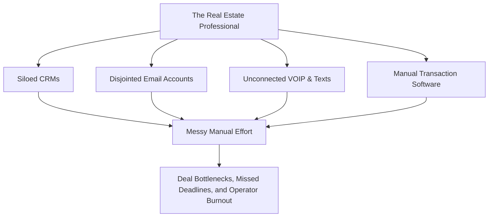
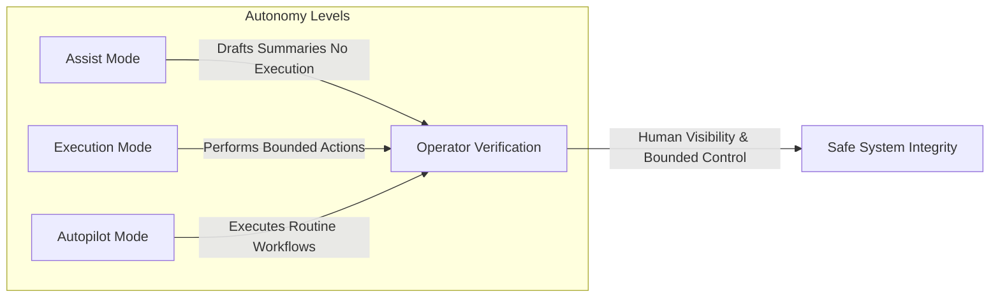

# DONNA: The Operational Layer for Real Estate
### Investor Presentation & Pitch Deck (V2)
*Digital Operations Neural Network Assistant (DONNA)*

---

## 📋 Table of Contents
1. [Slide 1: Title & Vision — The Operational Layer](#slide-1--title--vision--the-operational-layer)
2. [Slide 2: The Founder's Thesis — The Human Leverage Standard](#slide-2--the-founders-thesis--the-human-leverage-standard)
3. [Slide 3: The Problem — The Real Estate Coordination Crisis](#slide-3--the-problem--the-real-estate-coordination-crisis)
4. [Slide 4: The Solution — Sits Beneath the Stack](#slide-4--the-solution--sits-beneath-the-stack)
5. [Slide 5: The Four Pillars of Continuous Operation](#slide-5--the-four-pillars-of-continuous-operation)
6. [Slide 6: The Product Lineup — Stripe-Integrated Tiers](#slide-6--the-product-lineup--stripe-integrated-tiers)
7. [Slide 7: Trust, Security, and Sovereign Data](#slide-7--trust-security-and-sovereign-data)
8. [Slide 8: Controlled Autonomy — Tiers of Control](#slide-8--controlled-autonomy--tiers-of-control)
9. [Slide 9: DONNA Operating System — How We Build & Decide](#slide-9--donna-operating-system--how-we-build--decide)
10. [Slide 10: The Go-To-Market & Compound Network Moat](#slide-10--the-go-to-market--compound-network-moat)
11. [Slide 11: Unit Economics & Infrastructure Efficiency](#slide-11--unit-economics--infrastructure-efficiency)
12. [Slide 12: Capital Raise — Conviction-Aligned SAFE Structure](#slide-12--capital-raise--conviction-aligned-safe-structure)
13. [Slide 13: Ownership & Sensitivity Analysis](#slide-13--ownership--sensitivity-analysis)
14. [Slide 14: Year-1 Operating Postures by Raise Level](#slide-14--year-1-operating-postures-by-raise-level)
15. [Slide 15: Strategic Horizon Roadmap (2025 – 2028)](#slide-15--strategic-horizon-roadmap-2025--2028)
16. [Slide 16: The Investment Thesis — Proof Over Hype](#slide-16--the-investment-thesis--proof-over-hype)

---

## Slide 1 — Title & Vision — The Operational Layer

<div align="center">
  <br />
  <h1>D O N N A</h1>
  <p><strong>The Operational Layer for Real Estate.</strong></p>
  <p><em>Neural infrastructure that unifies communication, coordination, and execution into one continuous system.</em></p>
  <br />
</div>

> [!NOTE]
> **Foundational Premise:**
> DONNA is not a software application or a chat widget. It is quiet, clinical, background infrastructure designed to sit beneath a real estate business’s existing stack, routing information, automating deal handoffs, and governing action without forcing behavioral changes.

* **Quiet Integration:** Works invisibly in the background.
* **Continuous System:** Synchronizes fragmented CRMs, VOIP pipelines, and email threads.
* **Infrastructure Design:** Inspired by the robust, system-focused control planes of institutional systems.

---

## Slide 2 — The Founder's Thesis — The Human Leverage Standard

We are at a critical crossroads in the deployment of AI. One path seeks to replace people to cut costs; the other seeks to remove administrative friction to amplify human potential.

```
       ┌────────────────────────────────────────────────────────┐
       │                  THE AI CROSSROADS                     │
       ├───────────────────────────┬────────────────────────────┤
       │     THE REPLACEMENT PATH  │      THE DONNA PATH        │
       │  • Cut costs on paper     │  • Eliminate coordination  │
       │  • Eliminate vital roles  │    noise and friction      │
       │  • Stifle future talent   │  • Give people time back   │
       │  • Devalue human agency   │  • Amplify human leverage  │
       └───────────────────────────┴────────────────────────────┘
```

> [!IMPORTANT]
> **A Message from Founder Derek:**
> *"Most businesses do not have a talent problem. They have a coordination problem. Our goal is to prove that you can build a scalable, billion-dollar company by increasing human value, not removing it. DONNA is built to give smart, resourceful people doing the work in the middle of companies the leverage to truly innovate."*

* **Amplify, Don't Replace:** Systems engineered to support operators, ensuring work feels human again.
* **Long-Term Enterprise Alignment:** Rejecting short-term cost-cutting hype in favor of durable, trust-based customer relationships.

---

## Slide 3 — The Problem — The Real Estate Coordination Crisis

Real estate professionals do not need more tools. They are already overwhelmed by fragmented software.



### The Friction Points:
1. **Broken Communication Loops:** Agents, transaction coordinators, lenders, and escrow officers operate in separate silos, leading to endless chasing for documents and signatures.
2. **The "Help" Fallacy:** Traditional AI tools focus on helping agents write marketing copy or emails, but do nothing to ensure critical deal-flow actions actually occur.
3. **Severe Ambiguity:** Without a unified operational system, deadlines slip, follow-ups are missed, and relationships strain under manual operational overhead.

---

## Slide 4 — The Solution — Sits Beneath the Stack

DONNA sits beneath your existing software stack to route signals and govern actions automatically.

> [!TIP]
> **Active Governance over Prompting**
> Real estate operators do not want to prompt an AI. They want an operating layer that already knows a buyer's contract expires in three days, and automatically surfaces the necessary next steps to everyone involved.

- **Governs Action, Doesn't Just Generate Content:** Sits quietly beneath your CRMs and mailboxes to manage the operational control plane.
- **Adapts to the Team:** Zero behavior change required. The team works exactly as they do today; DONNA listens, aligns, and executes in the background.
- **Eliminates Ambiguity:** Ensures every task, message, and transaction milestone has clear ownership and visible status.

---

## Slide 5 — The Four Pillars of Continuous Operation

DONNA unifies real estate operations through a robust, four-layered architectural framework.

```
       ┌────────────────────────────────────────────────────────┐
       │                   1. UNIFIED CONTEXT                   │
       │  Synchronizes every signal across communication        │
       │  channels into a single, cohesive intelligence feed.    │
       ├────────────────────────────────────────────────────────┤
       │                  2. NETWORK ALIGNMENT                  │
       │  Automates handoffs between agents, buyers, lenders,    │
       │  and escrow to eliminate deal-flow friction.           │
       ├────────────────────────────────────────────────────────┤
       │                3. AUTONOMOUS EXECUTION                 │
       │  Drives background tasks through to completion by      │
       │  bridging the gap between the CRM and operations.      │
       ├────────────────────────────────────────────────────────┤
       │          4. DONNA INTELLIGENCE NETWORK (DIN)           │
       │  Compounding system knowledge that identifies patterns  │
       │  to accelerate deals without sharing private data.     │
       └────────────────────────────────────────────────────────┘
```

* **No-Hallucination Guardrails:** Operating on defined patterns and strict business SOPs.
* **Privacy-First Intelligence:** Federated learning allows the network to adapt without exposing raw, sensitive client records.

---

## Slide 6 — The Product Lineup — Stripe-Integrated Tiers

Our product SKUs (mapped directly in our core database and products architecture) scale logically to support operations from initial structure to unified intelligence.

| Product Title | Architectural Goal | Positioning Description |
**DONNA Starter** | Operational Structure | Run your business with standard structure, organizing core folders and initial task pipelines. |
**DONNA Lite** | Organizational Responsiveness | Get organized and responsive. Eliminates communication delays across basic channels. |
**DONNA Pro** | Continuous Intelligence | Sits beneath the entire stack. Operate with intelligence, routing signals and governing deal-critical actions. |
**Early Adopter (Core)** | Selective Priority Integration | Restricted to the first 100 users. Delivers fixed lifetime rates, priority network support, and influence over system evolution. |
**Early Adopter (Full Access)**| Full-Scale Deployment | Unlocks complete access across all four pillars of continuous operational infrastructure. |

---

## Slide 7 — Trust, Security, and Sovereign Data

Trust is not a marketing statement. It is engineered directly into our infrastructure.

> [!IMPORTANT]
> **The Sovereignty Standard**
> Real estate professionals hold deep fiduciary and client compliance responsibilities. DONNA enforces strict system-level compliance and data sovereignty safeguards.

- **Data is Sovereign:** Your client data is strictly yours. DONNA never shares, sells, or exposes private client documents or conversations.
- **Explainable Operations:** Every action taken by DONNA is traceably logged, explainable, and fully auditable by the operator.
- **Potentially Unsafe Inputs (PUI) Defense:** Treats external emails, document attachments, and voice calls as potentially unsafe, validating each signal before updating database records.
- **Fail Safe, Not Silent:** If an email or document instructions are ambiguous, DONNA pauses, notifies the human operator, and requests instruction rather than guessing.

---

## Slide 8 — Controlled Autonomy — Tiers of Control

Automation is never a default. It is a controlled choice. Operators select the precise boundaries and autonomy level for each workflow.



### The Tiers of Governance:
1. **Assist Mode:** Suggests, drafts, and summarizes incoming email replies and meeting items. Zero outbound execution occurs without manual click approval.
2. **Execution Mode:** Performs specific, approved operational actions within strictly defined boundaries (e.g. scheduling home inspections, updating CRM fields).
3. **Autopilot Mode:** Safely executes low-risk, highly repeatable workflows automatically, but only after user-defined rules and proven historical reliability.

---

## Slide 9 — DONNA Operating System — How We Build & Decide

Our company is built on the same rigorous operational principles that power our software.

* **Clarity Over Comfort:** We communicate with absolute clarity. We do not hide problems, bottlenecks, or design issues to protect optics.
* **Ownership is Always Clear:** Nothing belongs to "everyone." Every single task, decision, and milestone has a single, clear owner to prevent operational decay.
* **Outcomes Over Activity:** We do not reward message volume, task counts, or administrative busywork. We reward completed outcomes and real progress.
* **The System is Responsible:** If a mistake happens repeatedly, we do not blame people. We identify the breakdown in our system design and fix the root cause.
* **High Standards, No Ego:** Ideas are tested, assumptions are challenged, and the best strategic outcome wins. Ego slows progress; standards drive it.

---

## Slide 10 — The Go-To-Market & Compound Network Moat

We bypass high-CAC direct marketing by utilizing pre-established, high-trust institutional real estate channels.

```mermaid
mindmap
  root((Acquisition Channels))
    Institutional Pipelines
      West San Gabriel Valley REALTORS (WSGVR)
      Monterey Park Chamber of Commerce
    Expos & Keynotes
      4x Small Business Expos
      4x Major AI Forums
      CAR & NAR Installations
    Live Product Demos
      Interactive Chatbot CTAs (Live SOP Workflows)
    The Ultimate Moat
      DONNA Intelligence Network (DIN) Federated Learnings
```

* **Live Proof Inbounds:** Instead of standard contact forms, our website chatbot is positioned as a live demonstration of capability. Prospects ask the bot to handle their specific workflow, proving capability instantly.
* **The Compounding Moat (DIN):** As more brokerages and lenders deploy DONNA, the **DONNA Intelligence Network (DIN)** identifies anonymous handoff patterns. Early adopters gain permanent operational and cost advantages, creating a highly defensive network effect.

---

## Slide 11 — Unit Economics & Infrastructure Efficiency

DONNA is engineered on a highly optimized, AWS-native architecture that maintains superior software gross profit margins at scale.

```
┌────────────────────────────────────────────────────────────────┐
│                   YEAR-1 MARGIN EFFICIENCY                     │
├────────────────────────────────────────────────────────────────┤
│  • Operational Cost to Serve 100k Active Accounts:   <$20k/mo  │
│  • Targeted Average Revenue Per Contract (ARPU):     $5k/mo    │
│  • Projected Year-1 Enterprise Gross Profit Margin:   87%      │
└────────────────────────────────────────────────────────────────┘
```

- **Inference Optimization:** Leveraging custom AWS Bedrock parameters, semantic vector caching, and Verizon VOIP pathways to drive down the cost of multi-turn voice and email reasoning.
- **Asymmetric Value Creation:** While infrastructure operational costs are structurally optimized, the immense time and friction saved for real estate brokerages easily justifies high-value SaaS and wholesale pricing.

---

## Slide 12 — Capital Raise — Conviction-Aligned SAFE Structure

We are raising **$2,000,000** via a standard **Simple Agreement for Future Equity (SAFE)** structure. This raise rewards investor conviction with optimized economics, while preserving a highly investable cap table for future institutional Series rounds.

> [!NOTE]
> **Conviction Pricing:**
> Our SAFE options are structured to directly incentivize larger check commitments with increasingly favorable entry economics, without causing early founder dilution.

### SAFE Investment Tiers:
* **Option 1: $500,000 SAFE**
  * **$18.0M Valuation Cap** | 10% Discount
* **Option 2: $1,000,000 SAFE**
  * **$15.0M Valuation Cap** | 15% Discount
* **Option 3: $2,000,000 SAFE (Full Round)**
  * **$12.0M Valuation Cap** | 20% Discount

*Use of Proceeds:* AWS native infrastructure velocity, carrier-grade telecom pipeline scaling, regional GTM distributions, and sales force expansion.

---

## Slide 13 — Ownership & Sensitivity Analysis

The SAFE raises convert at whichever method (Valuation Cap or Discount) produces the more favorable effective entry price for the investor in our future priced equity financing round.

### Break-Even Valuation Points:
The pre-money valuation at which the cap and discount produce identical conversion outcomes. Above this valuation, the cap dominates; below it, the discount dominates.
- **$500K SAFE Break-Even:** **$20.0M** Pre-Money Valuation
- **$1M SAFE Break-Even:** **$17.65M** Pre-Money Valuation
- **$2M SAFE Break-Even:** **$15.0M** Pre-Money Valuation

### Modeled Ownership and Exit Value:
| Option | Investment | Ownership (Cap-Dominant Case) | Ownership (Discount-Dominant Case) | Value at $1B Exit (Cap-Dominant Case) | Value at $1B Exit (Discount-Dominant Case) | Approximate Founder Retention (Post-Conversion) |
| :--- | :---: | :---: | :---: | :---: | :---: | :---: |
| **$500K SAFE** | $500,000 | **2.78%** | **5.56%** | **$27.8M** | **$55.6M** | **~97.22%** |
| **$1M SAFE** | $1,000,000 | **6.67%** | **11.76%** | **$66.7M** | **$117.6M** | **~93.33%** |
| **$2M SAFE** | $2,000,000 | **16.67%** | **20.00%** | **$166.7M** | **$200.0M** | **~83.33%** |

---

## Slide 14 — Year-1 Operating Postures by Raise Level

The three raise options support structurally different operating plans and postures. They are not interchangeable.

```
       ┌────────────────────────────────────────────────────────┐
       │             YEAR-1 OPERATIONS & POSTURES               │
       ├────────────────────────────────────────────────────────┤
       │  $500K RAISE:   MVP & Design-Partner Posture           │
       │  • Complete core product development.                  │
       │  • Build traction with a small set of design partners. │
       │  • Lean, fractional team footprint.                    │
       ├────────────────────────────────────────────────────────┤
       │  $1M RAISE:     Product + Early Revenue Posture        │
       │  • Accelerate dev velocity & simplify onboarding.      │
       │  • Deploy repeatable, experimental customer sales.     │
       │  • Show undeniable market pull and early SaaS MRR.    │
       ├────────────────────────────────────────────────────────┤
       │  $2M RAISE:     Accelerated GTM Posture ($100k MRR)    │
       │  • Full product, ops, and GTM hiring buildout.         │
       │  • Full Year-1 scale targeting $100K MRR by Month 12.  │
       │  • Solidify major valuation step-up evidence.          │
       └────────────────────────────────────────────────────────┘
```

---

## Slide 15 — Strategic Horizon Roadmap (2025 – 2028)

```
        2025: SYSTEMS & INTEGRATION                 2026: DISTRIBUTION & DIN SCALE
     ┌──────────────────────────────┐              ┌──────────────────────────────┐
     │ • Complete AWS Bedrock Core  │              │ • Onboard Regional Brokerages│
     │ • Launch Starter/Lite/Pro    │─────────────►│ • First DIN Federated Deploy │
     │ • Low-Latency Voice Ready    │              │ • Keynotes at CAR & NAR      │
     └──────────────────────────────┘              └──────────────┬───────────────┘
                                                                  │
                                                                  ▼
        2028: SOVEREIGN AGENCY NETWORKS             2027: MARKETPLACE & SCALE
     ┌──────────────────────────────┐              ┌──────────────────────────────┐
     │ • Fully Sovereign Operations │              │ • Launch DONNA App Store     │
     │ • Cross-Brokerage Auto Handoff◄─────────────│ • International Expansion    │
     │ • Multi-Agent Collaboration  │              │ • 100k+ Active Operations    │
     └──────────────────────────────┘              └──────────────────────────────┘
```

- **Phase I (2025): Systems & Integration:** Finalize robust AWS VPC data paths, deploy our core Stripe product catalog, and optimize multi-turn low-latency voice pipelines.
- **Phase II (2026): Regional Distribution:** Secure direct brokerage lines via West San Gabriel Valley REALTORS (WSGVR) partnerships, launch the DIN federated signal network, and deliver CAR/NAR installations.
- **Phase III (2027): App Store & Scale:** Deploy the DONNA App Store for third-party transaction integrations, expand into international markets, and cross 100,000 active business accounts.
- **Phase IV (2028): Sovereign Agency Networks:** Enable secure cross-brokerage transactions, allowing independent DONNA instances to autonomously align escrow, lending, and sales.

---

## Slide 16 — The Investment Thesis — Proof Over Hype

```
┌────────────────────────────────────────────────────────────────┐
│                       INVESTMENT THESIS                        │
├────────────────────────────────────────────────────────────────┤
│  • Exceptional software margins (87% gross profit margin)      │
│  • Highly defensive carrier-grade infrastructure & telecom moat│
│  • Strategic distribution pipelines that bypass high-CAC ads   │
│  • Deep human-centric conviction that increases labor value   │
└────────────────────────────────────────────────────────────────┘
```

> [!IMPORTANT]
> **A Scalable, Meaningful, and Human Company**
> When this works, it will not just be a highly profitable product. It will be proof. Proof that you can build a highly valuable billion-dollar company without replacing the people who helped you get there.

### Partner with us to deploy capital with conviction.

**Contact Information:**
* **Lead Founder:** Derek & The DONNA Leadership Team
* **Primary Domain:** [aidonna.co](https://aidonna.co)
* **Selective Round:** $2,000,000 SAFE Series (Tiers: $500k / $1M / $2M)

---
*Disclaimer: This document is for informational purposes only and does not constitute an offer to sell or a solicitation of an offer to buy any securities. Any investment in early-stage SaaS companies involves high levels of risk.*
