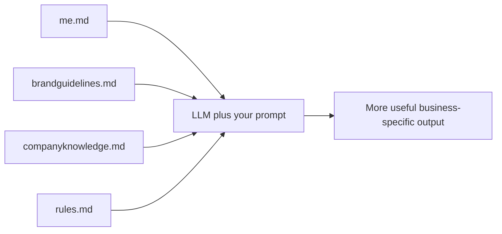

# Workshop-Ready Markdown Templates

## Executive summary

The package below is designed as a copy-and-paste class handout for your AI workshop. It follows the same teaching logic already established in your slide deck: AI gets more useful when it has business context, and the simplest way to provide that context is through four clear files that function like an “AI Employee Handbook.” The deliverable is written for non-technical small business owners, keeps the language plain, and is structured so attendees can fill in the blanks and use the files right away. fileciteturn0file0

## Why these four files work

Your current deck separates context into four roles: who the person is, how the brand sounds, what the company knows, and what rules the AI must follow. That separation is valuable because it makes the files easier to maintain, reduces contradictions, and lets business owners update one part of their context without rewriting everything else. The document below preserves that structure and converts it into practical templates with examples, short and long samples, prompt snippets, and simple upkeep guidance. fileciteturn0file0

## How to demo them in class

The cleanest class demo is the one your deck already points toward: run a generic business prompt with no files attached, show the weak result, then upload the four Markdown files and run the exact same prompt again. That before-and-after sequence makes the lesson visible in seconds: better tone, better specificity, better accuracy, and better alignment to the business. From there, you can naturally transition into your coding preview and DONNA mention as the “what comes next” section of the workshop. fileciteturn0file0

## Concatenated Markdown files

````md
# Executive Summary

These four Markdown files act like a simple AI employee handbook for a small business.

They help an LLM answer with more context by telling it:

- who you are
- how your brand sounds
- what your business knows
- what rules it must follow

The goal is not to make these files perfect. The goal is to make them useful.

Good context files are:

- true
- specific
- easy to update
- written in plain English
- organized so both people and AI can skim them quickly

If you only have a short amount of time, complete these in this order:

1. `me.md`
2. `companyknowledge.md`
3. `brandguidelines.md`
4. `rules.md`

Use short bullet points when possible. Add dates to anything that changes often. If you do not know something yet, say so plainly instead of guessing.



## Instructor Note

Here is the easiest way to present these files in class:

Start with one simple prompt and no files attached. Use something like, “Write a marketing email for my business.” Let the room see how generic the answer feels.

Next, upload all four files and run the exact same prompt again.

Then ask three questions:

- What changed about the tone?
- What changed about the details?
- What changed about the trust level of the answer?

Your teaching point is simple: better prompting helps, but better context helps even more.

A good live sequence is:

1. Show the generic result.
2. Upload `me.md` and rerun.
3. Upload all four files and rerun again.
4. Explain why each file improved the result.
5. End by telling attendees that these files can also help with AI research, customer responses, content, SOPs, and coding tools.

## Five Ready-to-Run Prompts

### Prompt 1

```text
Using the attached me.md, brandguidelines.md, companyknowledge.md, and rules.md, write a friendly and professional follow-up email to a new lead who asked about my services today.

If any information is missing, ask up to 3 clarifying questions before drafting.
```

### Prompt 2

```text
Using the attached me.md, brandguidelines.md, companyknowledge.md, and rules.md, write a one-week social media content plan for my business.

Include:
- 3 educational posts
- 1 promotional post
- 1 trust-building post

Keep the writing aligned to my brand voice and target audience.
```

### Prompt 3

```text
Using the attached me.md, brandguidelines.md, companyknowledge.md, and rules.md, create a homepage draft for my business website.

Include:
- headline
- subheadline
- services overview
- trust section
- call to action

Use plain English and avoid hype.
```

### Prompt 4

```text
Using the attached me.md, brandguidelines.md, companyknowledge.md, and rules.md, answer this customer question as if you were my office manager:

[PASTE CUSTOMER QUESTION]

If the answer depends on missing facts, say what is known, what is unknown, and what needs confirmation.
```

### Prompt 5

```text
Using the attached me.md, brandguidelines.md, companyknowledge.md, and rules.md, turn the notes below into a simple SOP for my team.

[PASTE NOTES]

Format the result with:
- purpose
- owner
- steps
- common mistakes
- escalation path
```

--- me.md ---

# Me

## Purpose

This file tells the AI who I am.

It gives the model enough personal and professional context to write in a way that feels more natural, more relevant, and more aligned with my real priorities.

This file is about the human behind the business.

Use it to explain:

- who you are
- what you do
- who you help
- what matters to you
- how you like to communicate
- when you are available
- what goals you are focused on right now

## Why This File Improves AI Output

Without this file, the AI usually writes in a generic voice.

With this file, the AI can better understand:

- your role
- your expertise
- your audience
- your priorities
- your working style
- your preferred tone

That means better drafts, better recommendations, and fewer answers that feel like they were written for a random person.

## Required Fields

These are the fields every business owner should complete.

- Full name
- Business name
- Role or title
- Short bio
- What you do
- Who you help
- Current goals
- Key skills or expertise
- Preferred tone
- Availability or working hours
- Service area, region, or market

## Optional Fields

These are helpful, but not required.

- Pronouns
- Years of experience
- Personal story
- Certifications
- Industries you know well
- Industries you do not serve
- Tools or platforms you use often
- Topics you enjoy talking about
- Topics you want to avoid
- Languages spoken
- Hobbies or community involvement
- Decision-making style
- Meeting style
- Travel schedule
- Preferred turnaround time for drafts

## Concrete Examples

Weak entry:

- I help people with real estate.

Better entry:

- I help first-time homebuyers in the San Gabriel Valley understand financing, home tours, offers, and closing in plain English.

Weak entry:

- My tone should be good.

Better entry:

- My tone should be professional, warm, and practical. I want to sound confident but never arrogant. Avoid sounding pushy, overly casual, or salesy.

Weak entry:

- I am available often.

Better entry:

- I usually respond Monday through Friday from 8:30 AM to 5:30 PM Pacific. I may answer urgent client questions after hours, but I do not want AI to promise instant responses nights or Sundays.

## Copy-and-Paste Template

```md
# Me

## File Purpose
This file tells AI who I am, what I do, how I communicate, and what matters to me.

## Last Updated
[YYYY-MM-DD]

## Basic Profile
- Full name:
- Business name:
- Role/title:
- Pronouns:
- Industry:
- Location:
- Time zone:
- Service area or market:

## Short Bio
[Write 2 to 5 sentences about who you are, your experience, and the kind of work you do.]

## What I Do
[Explain what you do in plain English.]

## Who I Help
[Describe your ideal customers or audience.]

## Current Goals
- Goal 1:
- Goal 2:
- Goal 3:

## Skills and Expertise
- Skill 1:
- Skill 2:
- Skill 3:
- Skill 4:

## Communication Preferences
- Preferred tone:
- Preferred reading level:
- Do I prefer short or detailed answers?:
- Do I like bullet points, paragraphs, or both?:
- Words or phrases I like:
- Words or phrases I dislike:

## Working Style
- How I make decisions:
- How I like options presented:
- How I handle urgency:
- How I want follow-up reminders framed:

## Availability
- Business hours:
- Best days/times to schedule:
- Typical response window:
- Times I am usually unavailable:
- What AI should not promise on my behalf:

## Tools I Use
- Email platform:
- Calendar platform:
- CRM:
- Social media platforms:
- Documents/storage tools:
- Other important tools:

## Boundaries and Preferences
- Topics I want handled carefully:
- Topics I do not want AI to guess about:
- Personal boundaries:
- Brand or legal sensitivities I want respected:

## Extra Context
[Any other details that would help AI sound more like me.]
```

## Short Sample Entry

```md
# Me

## Last Updated
2026-06-08

## Basic Profile
- Full name: Elena Rivera
- Business name: Harbor Home Services
- Role/title: Owner
- Industry: Home services
- Location: Orange County, California
- Time zone: Pacific Time
- Service area or market: Orange County homeowners and small commercial clients

## Short Bio
I am the owner of Harbor Home Services. I help homeowners keep their HVAC and plumbing systems running smoothly. I care about clear communication, reliable follow-through, and making technical topics easy to understand.

## What I Do
I run day-to-day operations, approve marketing, review customer communication, and help grow our maintenance membership program.

## Who I Help
We mainly help homeowners, busy families, landlords, and small property managers.

## Current Goals
- Increase maintenance memberships
- Improve lead follow-up speed
- Create clearer customer email templates

## Skills and Expertise
- Operations
- Customer communication
- Service sales
- Team leadership

## Communication Preferences
- Preferred tone: Warm, practical, professional
- Preferred reading level: Plain English
- Do I prefer short or detailed answers?: Short first, detail if needed
- Do I like bullet points, paragraphs, or both?: Both
- Words or phrases I like: straightforward, helpful, reliable
- Words or phrases I dislike: disruptive, revolutionary, game-changing

## Availability
- Business hours: Monday to Friday, 8:00 AM to 5:00 PM
- Typical response window: Same business day
- What AI should not promise on my behalf: Immediate response after hours or Sunday availability
```

## Long Sample Entry

```md
# Me

## Last Updated
2026-06-08

## Basic Profile
- Full name: Elena Rivera
- Business name: Harbor Home Services
- Role/title: Founder and Owner
- Pronouns: she/her
- Industry: Residential HVAC and plumbing
- Location: Orange County, California
- Time zone: Pacific Time
- Service area or market: Irvine, Tustin, Orange, Santa Ana, Costa Mesa, and nearby communities

## Short Bio
I founded Harbor Home Services after working for more than 12 years in customer service and field operations for local service businesses. My role now is a mix of leadership, marketing, customer experience, and business development. I want our company to feel reliable, organized, and easy to work with. When AI writes for me, it should sound like a capable owner who respects the customer’s time and avoids pressure tactics.

## What I Do
I oversee our office team, review service communication, improve follow-up processes, approve marketing messages, and help shape our local reputation. I often need help turning rough ideas into polished customer-facing content, training notes, and internal process documents.

## Who I Help
Our main customers are homeowners who want trustworthy help without confusing jargon. We also work with landlords and a small number of commercial property managers. Most of our customers care about speed, clarity, cleanliness, and knowing the price range before they commit.

## Current Goals
- Grow our maintenance membership plan this quarter
- Reduce dropped leads by improving follow-up speed
- Standardize our email and text templates
- Create more educational content that builds trust
- Save time by using AI for drafts, FAQs, and first-pass SOPs

## Skills and Expertise
- Team leadership
- Customer service
- Operations planning
- Service business marketing
- Local networking
- Vendor coordination
- Process improvement

## Communication Preferences
- Preferred tone: Professional, warm, practical, reassuring
- Preferred reading level: Plain English that a busy homeowner can understand quickly
- Do I prefer short or detailed answers?: Start short and organized; add detail when needed
- Do I like bullet points, paragraphs, or both?: Both
- Words or phrases I like: clear next steps, reliable, honest, helpful, local
- Words or phrases I dislike: industry-leading, unbeatable, miracle fix, cutting-edge, revolutionary
- How should AI handle technical topics?: Explain them simply first, then add optional detail
- How should AI handle marketing?: Focus on clarity, trust, and benefits. Never sound pushy.

## Working Style
- How I make decisions: I like 2 or 3 clear options with a recommendation
- How I like options presented: Best option first, then alternatives
- How I handle urgency: Mark what is urgent versus what can wait
- How I want follow-up reminders framed: Helpful and professional, not aggressive

## Availability
- Business hours: Monday through Friday, 8:00 AM to 5:00 PM
- Best days/times to schedule: Weekday mornings and early afternoons
- Typical response window: Same business day during office hours
- Times I am usually unavailable: Sunday and most evenings
- What AI should not promise on my behalf: Emergency scheduling, discounts, or same-day availability unless confirmed elsewhere

## Tools I Use
- Email platform: Gmail
- Calendar platform: Google Calendar
- CRM: Housecall Pro
- Social media platforms: Facebook, Instagram
- Documents/storage tools: Google Drive
- Other important tools: QuickBooks, Canva

## Boundaries and Preferences
- Topics I want handled carefully: Pricing disputes, negative reviews, and refund requests
- Topics I do not want AI to guess about: Permit requirements, exact service availability, or financing approval
- Personal boundaries: I do not want messages written as if I am available 24/7
- Brand or legal sensitivities I want respected: Do not make claims we cannot prove

## Extra Context
I want AI to save me time, but I still want the final result to sound human. If a draft sounds robotic, overconfident, or too polished to feel real, revise it into something more grounded and conversational.
```

## Prompt Snippets for Using This File

Use these when you only want to take advantage of personal context.

### Prompt Snippet 1

```text
Using my attached me.md, write a short networking introduction I can use at a Chamber event.
```

### Prompt Snippet 2

```text
Using my attached me.md, rewrite this message so it sounds more like me:
[PASTE MESSAGE]
```

### Prompt Snippet 3

```text
Based on my attached me.md, give me 5 content ideas that fit my goals, role, and audience.
```

### Prompt Snippet 4

```text
Use my attached me.md to draft a reply that respects my availability and working style.
```

## Tips for Keeping This File Current

Review this file at least once a month.

Update it when:

- your role changes
- your goals change
- your service area changes
- your preferred tone changes
- your schedule changes
- your tools change

A simple rule works well:

- update fast-changing items monthly
- update slower items quarterly

The most important fields to keep current are goals, availability, and tone.

--- brandguidelines.md ---

# Brand Guidelines

## Purpose

This file teaches AI how your business should sound.

If `me.md` explains the person, `brandguidelines.md` explains the voice of the company.

This file is where you define:

- brand personality
- audience
- core messaging
- words to use
- words to avoid
- writing rules
- channel-specific examples

This is the file that keeps your marketing and communication from sounding random.

## Why This File Improves AI Output

Without brand guidance, AI often sounds generic, inconsistent, or too salesy.

With a good brand file, AI can better understand:

- how formal or informal the brand should sound
- what promises the brand makes
- what claims should be avoided
- how to adapt the voice across email, social, and website copy
- how to stay consistent across multiple drafts

## Required Fields

Every business should include these.

- Brand name
- One-sentence company description
- Target audience
- Brand promise
- Voice attributes
- Messaging pillars
- Dos
- Don’ts
- Approved words or phrases
- Words or phrases to avoid
- Sample messaging for email
- Sample messaging for social
- Sample messaging for website copy
- Basic style guide for grammar, punctuation, and formatting

## Optional Fields

These are useful if you have them.

- Tagline
- Brand story
- Mission statement
- Competitive position
- Preferred calls to action
- Testimonials or proof points
- Compliance or regulated-language notes
- Seasonal messaging notes
- Community involvement
- Visual notes for designers
- Emoji policy
- Reading level target

## Voice Attributes

Choose 3 to 5 voice attributes and define each one.

Weak list:

- Friendly
- Professional

Better list:

- Professional: We sound competent and calm, not stiff or corporate.
- Friendly: We sound welcoming and human, not overly casual or jokey.
- Practical: We focus on useful information and next steps.
- Reassuring: We reduce stress and explain what to do next.
- No hype: We do not overpromise or use exaggerated language.

## Concrete Examples

Weak brand promise:

- We do great work.

Better brand promise:

- We make home service decisions easier by giving customers clear options, honest communication, and dependable follow-through.

Weak messaging pillar:

- We care about quality.

Better messaging pillar:

- We respect the customer’s time with clear scheduling windows, plain-English explanations, and updates when something changes.

Weak “don’t” list:

- Don’t sound weird.

Better “don’t” list:

- Do not use fear-based sales language, technical jargon without explanation, or exaggerated claims like “the best,” “guaranteed same-day” unless verified, or “limited-time miracle solution.”

## Copy-and-Paste Template

```md
# Brand Guidelines

## File Purpose
This file teaches AI how our brand should sound across all channels.

## Last Updated
[YYYY-MM-DD]

## Brand Snapshot
- Brand name:
- Company description:
- Tagline:
- Industry:
- Primary audience:
- Secondary audience:
- Service area:
- Main offer categories:

## Brand Promise
[What experience or result do you want people to associate with your business?]

## Audience Notes
### Primary Audience
- Who they are:
- What they care about:
- What problems they face:
- What words they would understand:
- What words they may not understand:

### Secondary Audience
- Who they are:
- What they care about:
- What problems they face:

## Voice Attributes
- Attribute 1:
  - Meaning:
  - What it sounds like:
  - What it should not sound like:
- Attribute 2:
  - Meaning:
  - What it sounds like:
  - What it should not sound like:
- Attribute 3:
  - Meaning:
  - What it sounds like:
  - What it should not sound like:
- Attribute 4:
  - Meaning:
  - What it sounds like:
  - What it should not sound like:
- Attribute 5:
  - Meaning:
  - What it sounds like:
  - What it should not sound like:

## Messaging Pillars
- Pillar 1:
- Pillar 2:
- Pillar 3:
- Pillar 4:

## Dos
- Do:
- Do:
- Do:
- Do:

## Don’ts
- Do not:
- Do not:
- Do not:
- Do not:

## Preferred Words and Phrases
- Use:
- Use:
- Use:
- Use:

## Words and Phrases to Avoid
- Avoid:
- Avoid:
- Avoid:
- Avoid:

## Calls to Action
- Preferred CTA 1:
- Preferred CTA 2:
- Preferred CTA 3:

## Channel Guidance

### Email
- Goal of email:
- Typical tone:
- Typical length:
- Preferred greeting style:
- Preferred sign-off style:
- What to avoid in email:

### Social Media
- Goal of social content:
- Typical tone:
- Typical length:
- Emoji policy:
- Hashtag policy:
- What to avoid on social:

### Website Copy
- Goal of website copy:
- Typical tone:
- Preferred reading level:
- Preferred structure:
- What to avoid on the website:

## Short Style Guide

### Grammar
- Use contractions?:
- Use active voice?:
- Reading level target:
- Preferred person: first person, second person, or third person?

### Punctuation
- Oxford comma?:
- Exclamation points?:
- Ellipses?:
- Em dashes?:

### Formatting
- Heading style:
- Paragraph length:
- Bullet point style:
- Bold text policy:
- Number style:
- Date format:

## Proof and Trust Elements
- Approved trust signals:
- Approved claims:
- Claims that require proof:
- Sensitive claims to avoid unless verified:

## Sample Messaging

### Sample Email
[Write a short example]

### Sample Social Post
[Write a short example]

### Sample Website Hero Section
[Write a short example]

## Extra Notes
[Any other brand notes that would help AI stay consistent.]
```

## Short Sample Entry

```md
# Brand Guidelines

## Last Updated
2026-06-08

## Brand Snapshot
- Brand name: Harbor Home Services
- Company description: We help homeowners keep their HVAC and plumbing systems reliable with clear communication and dependable service.
- Primary audience: Homeowners and busy families
- Secondary audience: Landlords and small property managers
- Service area: Orange County, California
- Main offer categories: HVAC repair, plumbing service, maintenance plans

## Brand Promise
We make home service decisions feel clear, honest, and manageable.

## Voice Attributes
- Professional:
  - Meaning: Calm and competent
  - What it sounds like: Organized, trustworthy, clear
  - What it should not sound like: Cold or corporate
- Friendly:
  - Meaning: Warm and welcoming
  - What it sounds like: Human and respectful
  - What it should not sound like: Sloppy or overly casual
- Practical:
  - Meaning: Useful and action-oriented
  - What it sounds like: Clear next steps
  - What it should not sound like: Vague or fluffy
- No hype:
  - Meaning: We do not exaggerate
  - What it sounds like: Honest and grounded
  - What it should not sound like: Pushy or dramatic

## Dos
- Use plain English
- Explain technical issues simply
- Focus on trust and next steps
- Keep promises realistic

## Don’ts
- Do not use fear-based language
- Do not overpromise
- Do not use too much jargon
- Do not sound flashy

## Preferred Words and Phrases
- Use: clear options
- Use: reliable service
- Use: honest advice
- Use: straightforward pricing

## Words and Phrases to Avoid
- Avoid: revolutionary
- Avoid: guaranteed same-day
- Avoid: miracle fix
- Avoid: unbeatable

## Sample Messaging

### Sample Email
Thanks for reaching out. We’re happy to help. Based on what you shared, the next best step is to schedule a visit so we can give you clear options and honest recommendations.

### Sample Social Post
Small problems usually stay small when they’re caught early. Regular maintenance can help you avoid bigger repairs and make your home more comfortable year-round.

### Sample Website Hero Section
Reliable home service with clear communication and honest recommendations.
```

## Long Sample Entry

```md
# Brand Guidelines

## Last Updated
2026-06-08

## Brand Snapshot
- Brand name: Harbor Home Services
- Company description: Harbor Home Services helps Orange County homeowners with HVAC and plumbing needs through clear communication, dependable scheduling, and practical solutions.
- Tagline: Clear options. Reliable service.
- Industry: Residential home services
- Primary audience: Homeowners, busy families, and aging homeowners who want trustworthy service
- Secondary audience: Landlords, real estate professionals, and small property managers
- Service area: Irvine, Tustin, Orange, Santa Ana, Costa Mesa, and nearby communities
- Main offer categories: HVAC repairs, plumbing repairs, maintenance plans, system replacements

## Brand Promise
We reduce stress by making service decisions easier to understand. Customers should feel informed, respected, and supported from first contact to follow-up.

## Audience Notes
### Primary Audience
- Who they are: Homeowners who value trust, speed, and clear explanations
- What they care about: Reliability, scheduling, cleanliness, and reasonable expectations
- What problems they face: Confusing technical language, uncertain pricing, and not knowing who to trust
- What words they would understand: repair, maintenance, comfort, inspection, options, next steps
- What words they may not understand: static pressure, load calculation, thermal expansion, condensate issue unless explained

### Secondary Audience
- Who they are: Landlords and small property managers
- What they care about: Response time, communication, and simple documentation
- What problems they face: Tenant coordination and recurring maintenance issues

## Voice Attributes
- Professional:
  - Meaning: Competent, organized, dependable
  - What it sounds like: Calm explanations, clear structure, realistic next steps
  - What it should not sound like: Stiff, legalistic, or robotic
- Friendly:
  - Meaning: Warm and human
  - What it sounds like: Respectful, conversational, easy to understand
  - What it should not sound like: Too casual, goofy, or overly familiar
- Practical:
  - Meaning: Useful, specific, action-oriented
  - What it sounds like: Here is what happened, here are your options, here is the next step
  - What it should not sound like: Abstract, fluffy, or overexplained
- Reassuring:
  - Meaning: Steady and confidence-building
  - What it sounds like: Calm guidance without drama
  - What it should not sound like: Fear-driven or manipulative
- No hype:
  - Meaning: Honest and grounded
  - What it sounds like: Accurate, measured, transparent
  - What it should not sound like: “Best ever,” “limited-time miracle,” or inflated promises

## Messaging Pillars
- Clear communication builds trust
- Honest recommendations matter more than pressure tactics
- Preventive maintenance saves time, money, and stress
- Good service includes follow-through, not just the repair

## Dos
- Use plain English
- Explain technical topics simply
- Lead with the customer’s problem and what to do next
- Be specific about the benefit of a service
- Keep the tone calm and trustworthy
- Make the call to action simple

## Don’ts
- Do not use fear-based sales language
- Do not sound like a flashy ad
- Do not overwhelm people with technical details
- Do not make claims we cannot prove
- Do not promise timing, discounts, or guarantees unless confirmed elsewhere
- Do not overuse exclamation points

## Preferred Words and Phrases
- clear options
- honest recommendations
- reliable service
- straightforward
- helpful follow-up
- practical next step

## Words and Phrases to Avoid
- revolutionary
- game-changing
- guaranteed same-day
- miracle fix
- industry-leading
- cheapest
- unbeatable

## Calls to Action
- Schedule your visit
- Request an estimate
- Ask us about next steps
- Contact us to learn your options

## Channel Guidance

### Email
- Goal of email: Inform, reassure, and guide the next step
- Typical tone: Professional, warm, and direct
- Typical length: Short to medium
- Preferred greeting style: Hi [First Name],
- Preferred sign-off style: Thank you, [Name]
- What to avoid in email: Long walls of text, pressure language, vague next steps

### Social Media
- Goal of social content: Educate, build trust, and stay top of mind
- Typical tone: Friendly and useful
- Typical length: Short to medium
- Emoji policy: Minimal and occasional
- Hashtag policy: Use only a few relevant tags
- What to avoid on social: Hard-selling every post, fear tactics, jargon-heavy captions

### Website Copy
- Goal of website copy: Explain value clearly and make it easy to contact us
- Typical tone: Clear, credible, approachable
- Preferred reading level: Plain English
- Preferred structure: Short sections, simple headings, obvious call to action
- What to avoid on the website: Buzzwords, clutter, and exaggerated claims

## Short Style Guide

### Grammar
- Use contractions?: Yes
- Use active voice?: Yes
- Reading level target: Plain English, easy to scan
- Preferred person: Mostly second person for customer-facing copy

### Punctuation
- Oxford comma?: Yes
- Exclamation points?: Use sparingly
- Ellipses?: Avoid unless necessary
- Em dashes?: Use sparingly

### Formatting
- Heading style: Sentence case
- Paragraph length: 1 to 3 sentences
- Bullet point style: Short, direct bullets
- Bold text policy: Use lightly for emphasis
- Number style: Numerals are fine for pricing, steps, and timelines
- Date format: Month day, year

## Proof and Trust Elements
- Approved trust signals: Licensed technicians, years of experience, local service area, maintenance plan members served
- Approved claims: Clear communication, local service, practical recommendations
- Claims that require proof: Best price, fastest service, number-one ranking
- Sensitive claims to avoid unless verified: Guarantees, medical or health claims, exact energy savings

## Sample Messaging

### Sample Email
Hi Sarah,

Thanks for reaching out about your AC issue. Based on what you shared, the next best step is for us to schedule a visit and confirm what is causing the problem. Once we take a look, we can walk you through clear options and help you choose the one that makes the most sense for your home and budget.

Thank you,  
Elena

### Sample Social Post
A small issue can turn into a bigger repair if it is ignored for too long. Regular maintenance helps you catch problems earlier, keep your system running better, and avoid extra stress when the weather gets busy.

### Sample Website Hero Section
Reliable HVAC and plumbing service with clear communication and honest recommendations.  
Schedule your visit and get practical next steps from a local team you can trust.

## Extra Notes
We want customers to feel relieved after reading our content. If the writing sounds dramatic, overly polished, or too “salesy,” revise it until it sounds more grounded and helpful.
```

## Prompt Snippets for Using This File

### Prompt Snippet 1

```text
Using my attached brandguidelines.md, rewrite this email so it matches my brand voice:
[PASTE EMAIL]
```

### Prompt Snippet 2

```text
Use my brandguidelines.md to write a Facebook post that sounds like my business and avoids hype.
```

### Prompt Snippet 3

```text
Using my brandguidelines.md, give me 3 versions of a homepage headline and subheadline that fit my audience.
```

### Prompt Snippet 4

```text
Use my brandguidelines.md to check this draft for tone problems, weak claims, and words that do not fit my brand.
```

## Tips for Keeping This File Current

Review this file every quarter.

Update it when:

- your audience changes
- your offers change
- your messaging changes
- you notice inconsistent content
- you add a new marketing channel
- you decide certain words no longer fit your brand

A simple habit helps:

Keep one running note of phrases you like and phrases you never want to see again. Add those to this file as you notice them.

--- companyknowledge.md ---

# Company Knowledge

## Purpose

This file is the factual brain of the business.

If `me.md` explains the person and `brandguidelines.md` explains the voice, `companyknowledge.md` explains what the company actually knows.

This is where you store the business facts that AI should use when answering questions or creating content.

Examples include:

- products
- services
- pricing
- frequently asked questions
- policies
- processes
- team information
- locations
- contact details

This file should be as accurate as possible. When facts change, this file should change too.

## Why This File Improves AI Output

Without this file, AI often fills gaps with generic assumptions.

With this file, AI can better answer:

- What do you sell?
- Who is it for?
- How much does it cost?
- What is included?
- What happens next?
- Who on the team handles what?
- Where do you operate?
- How should a basic customer question be answered?

This is usually the most powerful file for customer-facing prompts.

## Required Fields

Most businesses should include all of these.

- Business snapshot
- Products and services
- Pricing or pricing approach
- FAQs
- Core processes or SOPs
- Team bios
- Locations or service areas
- Contact information
- Last updated date

## Optional Fields

These are often helpful.

- Legal name and DBA
- Hours
- Guarantees or warranties
- Refund or cancellation policy
- Financing information
- Testimonials
- Case studies
- Onboarding details
- Delivery timelines
- Vendor notes
- Seasonal service notes
- Partnerships
- Compliance notes
- Internal glossary
- Common objections and responses

## Searchable Tag and Index Suggestion

A small searchable index makes this file even stronger.

Use short lowercase tags with hyphens.

Examples:

- `[service:maintenance-plan]`
- `[service:water-heater-replacement]`
- `[audience:homeowner]`
- `[location:orange-county]`
- `[faq:financing]`
- `[process:lead-intake]`

A good pattern is:

- add a master search index near the top
- add tags to repeatable sections
- include common aliases for your services

Example:

- “maintenance plan” may also be called “membership,” “service plan,” or “annual plan”
- “contact us” may also be called “book now,” “request service,” or “schedule a visit”

These alias notes help the AI find the right section faster.

## Concrete Examples

Weak service entry:

- AC service. We help people with air conditioning.

Better service entry:

- Service name: Seasonal AC Tune-Up  
- Best for: Homeowners who want to prevent breakdowns and improve efficiency before peak summer use  
- Includes: Filter check, thermostat check, temperature split check, visual inspection, basic cleaning, and service notes  
- Starting price: $129  
- Does not include: Major repairs or replacement parts

Weak FAQ:

- Q: Do you finance?  
- A: Yes.

Better FAQ:

- Q: Do you offer financing?  
- A: Financing may be available through a third-party partner for approved customers on qualifying jobs. Financing terms are not guaranteed and must be confirmed at the time of estimate.

Weak process:

- We follow up with leads.

Better process:

- Process: Lead follow-up  
- Trigger: A web form, phone call, or Facebook message comes in  
- Goal: Respond during business hours within 15 minutes when possible  
- Steps: Review request, confirm service area, confirm problem type, offer next step, document conversation, set reminder if no reply  
- Escalate if: The request includes safety concerns, active water damage, or a same-day emergency request we may not be able to support

## Copy-and-Paste Template

```md
# Company Knowledge

## File Purpose
This file stores the business facts AI should use when creating drafts or answering questions.

## Last Updated
[YYYY-MM-DD]

## Business Snapshot
- Legal name:
- Public-facing business name:
- Short company description:
- Industry:
- Primary audience:
- Secondary audience:
- Service area or locations:
- Business hours:
- Website:
- Booking link:
- Main phone:
- Main email:

## Search Index
- Core tags:
- Audience tags:
- Location tags:
- Product/service tags:
- FAQ tags:
- Process tags:
- Common aliases and alternate names:

## Products and Services

### Product or Service Template
- Name:
- Tags:
- Aliases:
- Category:
- One-line description:
- Best for:
- Customer problems it solves:
- Main outcomes:
- What is included:
- What is not included:
- Starting price or price range:
- Custom quote required?:
- Typical timeline:
- Delivery method or appointment type:
- Requirements before purchase or booking:
- Common objections:
- Recommended response to objections:
- Related upsells or cross-sells:
- Call to action:
- Notes:

## Pricing

### Pricing Notes
- Pricing model:
- Taxes or fees:
- Financing available?:
- Discounts or promotions:
- What AI may say confidently about pricing:
- What AI must not guess about pricing:

### Pricing Table
| Offer | Starting Price | Notes | Last Verified |
|---|---:|---|---|
| [Offer name] | [$0.00] | [Notes] | [YYYY-MM-DD] |

## Frequently Asked Questions

### FAQ Template
- Question:
- Short answer:
- Longer answer:
- Related offer or department:
- Tags:
- Last verified:

## Processes and SOPs

### Process Template
- Process name:
- Tags:
- Trigger:
- Owner:
- Goal:
- Tools used:
- Step-by-step instructions:
  1.
  2.
  3.
  4.
- Common mistakes:
- Escalation point:
- Success checklist:
- Last updated:

## Team Bios

### Team Member Template
- Name:
- Role:
- Main responsibilities:
- Areas of expertise:
- Communication style:
- What they can speak about confidently:
- What should be escalated beyond them:
- Best internal contact method:
- Short bio:

## Locations and Service Areas

### Location Template
- Name:
- Address:
- Cities or ZIP codes served:
- Hours:
- Special notes:
- Parking or appointment notes:
- Tags:

## Contact Information

### General Contact
- Main phone:
- Main email:
- Website:
- Booking link:
- Social links:
- Emergency or after-hours info:

### Department Contacts
- Sales:
- Support:
- Billing:
- Scheduling:
- Partnerships:

## Policies and Important Notes
- Refund policy:
- Cancellation policy:
- Warranty notes:
- Financing notes:
- Safety or compliance notes:
- What AI should never promise:

## Internal Glossary
- Term:
  - Meaning:
  - Customer-friendly explanation:

## Extra Notes
[Any additional information that could help AI answer more accurately.]
```

## Short Sample Entry

```md
# Company Knowledge

## Last Updated
2026-06-08

## Business Snapshot
- Public-facing business name: Harbor Home Services
- Short company description: We help homeowners with HVAC and plumbing service in Orange County.
- Primary audience: Homeowners
- Secondary audience: Landlords and small property managers
- Service area or locations: Orange County, California
- Business hours: Monday to Friday, 8:00 AM to 5:00 PM
- Main phone: (555) 010-2040
- Main email: hello@harborhomeservices.com

## Search Index
- Core tags: [service:hvac] [service:plumbing] [service:maintenance-plan]
- Audience tags: [audience:homeowner] [audience:landlord]
- Location tags: [location:orange-county]
- Common aliases and alternate names: membership = maintenance plan

## Products and Services

### Home Comfort Membership
- Tags: [service:maintenance-plan]
- Aliases: membership, annual plan
- Category: Maintenance
- One-line description: Ongoing maintenance plan for homeowners who want fewer surprises and priority scheduling.
- Best for: Homeowners who want preventive service
- What is included: Seasonal system checks, reminders, and member pricing on qualifying work
- Starting price or price range: $24/month or $249/year
- Call to action: Ask about membership options

## Pricing

### Pricing Notes
- Pricing model: Mix of flat-rate services and quote-based work
- What AI may say confidently about pricing: Starting prices that are listed here
- What AI must not guess about pricing: Final job totals without inspection

## Frequently Asked Questions

### FAQ
- Question: Do you offer financing?
- Short answer: Financing may be available on qualifying jobs.
- Longer answer: Financing may be available through a third-party partner for approved customers. Terms must be confirmed at the time of estimate.
- Tags: [faq:financing]
- Last verified: 2026-06-08

## Contact Information
### General Contact
- Main phone: (555) 010-2040
- Main email: hello@harborhomeservices.com
- Booking link: harborhomeservices.com/book
```

## Long Sample Entry

```md
# Company Knowledge

## Last Updated
2026-06-08

## Business Snapshot
- Legal name: Harbor Home Services LLC
- Public-facing business name: Harbor Home Services
- Short company description: Harbor Home Services helps Orange County homeowners with HVAC and plumbing repairs, maintenance, and replacement planning through clear communication and dependable service.
- Industry: Residential HVAC and plumbing
- Primary audience: Homeowners and busy families
- Secondary audience: Landlords, real estate agents, and small property managers
- Service area or locations: Irvine, Tustin, Orange, Santa Ana, Costa Mesa, and nearby communities
- Business hours: Monday through Friday, 8:00 AM to 5:00 PM
- Website: harborhomeservices.com
- Booking link: harborhomeservices.com/book
- Main phone: (555) 010-2040
- Main email: hello@harborhomeservices.com

## Search Index
- Core tags: [service:hvac-repair] [service:plumbing-repair] [service:maintenance-plan] [service:water-heater-replacement]
- Audience tags: [audience:homeowner] [audience:landlord] [audience:property-manager]
- Location tags: [location:orange-county] [location:irvine] [location:tustin]
- FAQ tags: [faq:financing] [faq:weekend-service] [faq:estimates]
- Process tags: [process:lead-intake] [process:estimate-follow-up] [process:service-visit]
- Common aliases and alternate names:
  - membership = maintenance plan
  - request service = book a visit
  - estimate = quote
  - system replacement = install

## Products and Services

### Seasonal AC Tune-Up
- Tags: [service:hvac-repair] [audience:homeowner]
- Aliases: AC maintenance, cooling tune-up
- Category: Maintenance
- One-line description: Preventive service visit to help catch small issues before heavy summer use.
- Best for: Homeowners who want to reduce the chance of breakdowns and improve system performance
- Customer problems it solves: Neglected maintenance, weak cooling, concern before hot weather
- Main outcomes: Better system awareness, basic preventive care, clearer recommendations
- What is included:
  - Visual system inspection
  - Thermostat check
  - Temperature split check
  - Filter review
  - Basic cleaning and notes
- What is not included:
  - Major repairs
  - Refrigerant leak repairs
  - Full part replacement
- Starting price or price range: $129
- Custom quote required?: No
- Typical timeline: 60 to 90 minutes
- Delivery method or appointment type: On-site visit
- Requirements before purchase or booking: Working access to the system
- Common objections:
  - “I’ll wait until something breaks.”
  - “I just changed the filter.”
- Recommended response to objections:
  - Maintenance helps catch issues early and gives clearer options before peak-season breakdowns
- Related upsells or cross-sells:
  - Home Comfort Membership
  - Thermostat upgrade
- Call to action: Schedule your seasonal tune-up
- Notes: Do not promise that maintenance prevents all future repairs

### Water Heater Replacement
- Tags: [service:water-heater-replacement] [audience:homeowner]
- Aliases: water heater install, hot water replacement
- Category: Replacement
- One-line description: Replacement options for failing or outdated residential water heaters.
- Best for: Homeowners dealing with leaks, age-related problems, or unreliable hot water
- Customer problems it solves: Inconsistent hot water, leaking unit, aging system
- Main outcomes: Improved reliability and safer operation
- What is included:
  - Equipment recommendation
  - Removal of old unit
  - New unit installation
  - Basic startup and walkthrough
- What is not included:
  - Drywall repair
  - Plumbing changes beyond normal install scope unless quoted
- Starting price or price range: Custom quote required
- Custom quote required?: Yes
- Typical timeline: Usually same day once scope is confirmed
- Delivery method or appointment type: On-site estimate and installation
- Requirements before purchase or booking: Site review may be required
- Common objections:
  - “Can you quote me exactly over text?”
- Recommended response to objections:
  - We can provide a rough range only after a few details, but final pricing depends on unit type, access, code requirements, and install conditions
- Related upsells or cross-sells:
  - Maintenance plan
  - Expansion tank review
- Call to action: Request an estimate
- Notes: Do not guess permit or code requirements

### Home Comfort Membership
- Tags: [service:maintenance-plan] [audience:homeowner]
- Aliases: membership, annual service plan, maintenance plan
- Category: Membership
- One-line description: Ongoing preventive plan for homeowners who want reminders, seasonal checks, and member benefits.
- Best for: Homeowners who want fewer surprises and easier maintenance planning
- Customer problems it solves: Missed maintenance, reactive repairs, no regular service schedule
- Main outcomes: Better upkeep, reminders, and easier follow-up
- What is included:
  - Seasonal reminders
  - Annual check schedule
  - Member pricing on qualifying work
  - Priority scheduling when available
- What is not included:
  - Guaranteed same-day service
  - Free major repairs
- Starting price or price range: $24/month or $249/year
- Custom quote required?: No
- Typical timeline: Starts immediately after enrollment
- Delivery method or appointment type: Ongoing plan
- Requirements before purchase or booking: Active home ownership or managed property
- Common objections:
  - “I do not want another subscription.”
- Recommended response to objections:
  - The plan is designed for homeowners who want a simple maintenance routine and fewer last-minute surprises
- Related upsells or cross-sells:
  - Tune-up services
  - Replacement planning consult
- Call to action: Ask us about membership options
- Notes: Do not promise savings numbers unless they are documented elsewhere

## Pricing

### Pricing Notes
- Pricing model: Mix of flat-rate maintenance services and quote-based repairs or replacements
- Taxes or fees: Standard taxes or disposal fees may apply where relevant
- Financing available?: May be available on qualifying replacement jobs through a third-party partner
- Discounts or promotions: Promotions may exist seasonally and must be confirmed before mention
- What AI may say confidently about pricing: Listed starting prices and listed membership pricing
- What AI must not guess about pricing: Final repair totals, replacement totals, financing approval, tax totals, or permit-related costs

### Pricing Table
| Offer | Starting Price | Notes | Last Verified |
|---|---:|---|---|
| Seasonal AC Tune-Up | $129 | Flat starting price for standard preventive visit | 2026-06-08 |
| Home Comfort Membership | $24/month | Annual option also available | 2026-06-08 |
| Home Comfort Membership | $249/year | Annual prepaid option | 2026-06-08 |
| Water Heater Replacement | Custom quote | Final amount depends on scope and install conditions | 2026-06-08 |

## Frequently Asked Questions

### FAQ
- Question: Do you offer financing?
- Short answer: Financing may be available on qualifying replacement jobs.
- Longer answer: Financing may be available through a third-party partner for approved customers on qualifying work. Terms, rates, and approval are not guaranteed and must be confirmed at the time of estimate.
- Related offer or department: Replacement sales
- Tags: [faq:financing]
- Last verified: 2026-06-08

### FAQ
- Question: Do you offer weekend service?
- Short answer: Limited weekend availability may exist for urgent situations.
- Longer answer: Regular business hours are Monday through Friday. Limited weekend help may be available in specific urgent cases, but availability should never be promised unless confirmed.
- Related offer or department: Scheduling
- Tags: [faq:weekend-service]
- Last verified: 2026-06-08

### FAQ
- Question: Can you give me an exact quote without seeing the job?
- Short answer: Sometimes we can give a rough range, but many jobs require inspection first.
- Longer answer: Final quotes may depend on access, parts, code requirements, equipment type, and the actual cause of the problem.
- Related offer or department: Estimates
- Tags: [faq:estimates]
- Last verified: 2026-06-08

## Processes and SOPs

### Lead intake
- Tags: [process:lead-intake]
- Trigger: Phone call, website form, text, or social message
- Owner: Customer care coordinator
- Goal: Gather enough information to route or schedule the request correctly
- Tools used: Phone, website form, CRM
- Step-by-step instructions:
  1. Confirm name, phone number, and service address
  2. Confirm service area
  3. Ask what issue the customer is experiencing
  4. Determine whether the request sounds urgent
  5. Offer the correct next step: schedule, estimate, or callback
  6. Log the details in the CRM
- Common mistakes:
  - Missing address
  - Missing callback number
  - Promising availability before it is confirmed
- Escalation point:
  - Safety concern
  - Active flooding
  - Gas-related concern
  - High-conflict or legal language
- Success checklist:
  - Customer details captured
  - Need identified
  - Next step clearly stated
  - CRM updated
- Last updated: 2026-06-08

### Estimate follow-up
- Tags: [process:estimate-follow-up]
- Trigger: Estimate sent but no decision yet
- Owner: Office manager or owner
- Goal: Follow up helpfully without sounding pushy
- Tools used: Email, phone, CRM
- Step-by-step instructions:
  1. Review estimate details
  2. Confirm how long it has been since the estimate was sent
  3. Send a short check-in message
  4. Ask whether the customer has questions
  5. Offer clarification or next steps
  6. Set a reminder if there is no reply
- Common mistakes:
  - Following up too aggressively
  - Restating technical details without translating them
- Escalation point:
  - Pricing dispute
  - Complaint about prior service
- Success checklist:
  - Tone stays professional
  - Customer has a clear next step
  - Follow-up is documented
- Last updated: 2026-06-08

## Team Bios

### Elena Rivera
- Name: Elena Rivera
- Role: Founder and Owner
- Main responsibilities: Leadership, customer communication review, estimates, marketing approvals
- Areas of expertise: Operations, customer experience, service business growth
- Communication style: Calm, practical, direct
- What they can speak about confidently: Company direction, customer experience, offers, memberships
- What should be escalated beyond them: Legal matters
- Best internal contact method: Email
- Short bio: Elena leads the business and shapes customer communication, service standards, and growth strategy.

### Marcus Chen
- Name: Marcus Chen
- Role: Operations Manager
- Main responsibilities: Scheduling support, technician coordination, process improvements
- Areas of expertise: Field workflow, dispatch, service quality
- Communication style: Efficient and clear
- What they can speak about confidently: Daily operations and scheduling realities
- What should be escalated beyond them: Pricing exceptions and legal issues
- Best internal contact method: Phone
- Short bio: Marcus helps keep the day moving and makes sure jobs are routed correctly.

### Sofia Martinez
- Name: Sofia Martinez
- Role: Customer Care Coordinator
- Main responsibilities: First responses, appointment booking, lead intake
- Areas of expertise: Customer communication and follow-up
- Communication style: Friendly and organized
- What they can speak about confidently: Scheduling steps, basic FAQs, service area
- What should be escalated beyond them: Technical diagnosis and disputes
- Best internal contact method: CRM or phone
- Short bio: Sofia is often the first point of contact and helps customers understand the next step.

## Locations and Service Areas

### Orange County service area
- Name: Orange County service area
- Address: Mobile service business
- Cities or ZIP codes served: Irvine, Tustin, Orange, Santa Ana, Costa Mesa, and nearby communities
- Hours: Monday through Friday, 8:00 AM to 5:00 PM
- Special notes: Weekend availability is limited and must be confirmed
- Parking or appointment notes: Customers should provide gate or parking instructions when relevant
- Tags: [location:orange-county]

## Contact Information

### General Contact
- Main phone: (555) 010-2040
- Main email: hello@harborhomeservices.com
- Website: harborhomeservices.com
- Booking link: harborhomeservices.com/book
- Social links:
  - Facebook: facebook.com/harborhomeservices
  - Instagram: instagram.com/harborhomeservices
- Emergency or after-hours info: After-hours emergency response may be limited and must not be promised unless confirmed

### Department Contacts
- Sales: sales@harborhomeservices.com
- Support: hello@harborhomeservices.com
- Billing: billing@harborhomeservices.com
- Scheduling: schedule@harborhomeservices.com
- Partnerships: partners@harborhomeservices.com

## Policies and Important Notes
- Refund policy: Case-by-case and must not be promised without review
- Cancellation policy: Confirm current policy before stating fees or exceptions
- Warranty notes: Warranty details depend on the service or equipment
- Financing notes: Third-party financing may be available for approved customers on qualifying jobs
- Safety or compliance notes: Do not guess permit, code, or safety requirements
- What AI should never promise:
  - exact pricing without inspection
  - same-day service without confirmation
  - permit requirements without confirmation
  - financing approval
  - refund approval

## Internal Glossary
- static pressure:
  - Meaning: A technical HVAC performance concept
  - Customer-friendly explanation: One of the measurements technicians may use to understand how well air is moving through the system
- thermal expansion tank:
  - Meaning: A plumbing component used in specific water heater setups
  - Customer-friendly explanation: A part that helps manage pressure changes in some plumbing systems

## Extra Notes
Use this file as the source of truth for facts. If a customer-facing response depends on something not listed here, say that confirmation is needed instead of guessing.
```

## Prompt Snippets for Using This File

### Prompt Snippet 1

```text
Using my attached companyknowledge.md, answer this customer question in plain English:
[PASTE QUESTION]
```

### Prompt Snippet 2

```text
Use my companyknowledge.md to create a one-page FAQ section for my website.
```

### Prompt Snippet 3

```text
Using my companyknowledge.md, compare my top 3 services in a simple table for a customer who is not technical.
```

### Prompt Snippet 4

```text
Use my companyknowledge.md to draft a new team member training sheet that explains our lead intake process and common FAQs.
```

## Tips for Keeping This File Current

Review this file at least once a month.

Update it when:

- pricing changes
- services change
- FAQs change
- team roles change
- hours change
- service areas change
- policies change
- processes change

Best practice:

- Put a “Last verified” date on pricing and FAQ entries
- Add tags to new services as you create them
- Remove outdated offers instead of leaving them buried in the file
- If something should not be guessed, say that clearly

This file is strongest when it is short enough to trust and detailed enough to be useful.

--- rules.md ---

# Rules

## Purpose

This file gives the AI its guardrails.

If the other files tell AI who you are, how you sound, and what your business knows, `rules.md` tells AI how it must behave.

This is the file that protects you from made-up facts, overconfident answers, sloppy formatting, privacy mistakes, and risky responses.

## Why This File Improves AI Output

Without rules, AI may:

- guess when it should ask
- sound too certain when facts are missing
- reveal or repeat sensitive information
- use the wrong format
- skip important disclaimers
- write something that should really be escalated to a human

With clear rules, the model becomes more careful and more reliable.

## Required Fields

Every business should define these.

- Accuracy rules
- Citation or source-reference rules
- Uncertainty handling rules
- Clarifying question rules
- Formatting defaults
- Privacy and security rules
- Escalation triggers
- Approval-required situations

## Optional Fields

These are also useful.

- Channel-specific formatting rules
- Reading level rules
- Compliance language
- Legal or medical caution notes
- Customer service rules
- Refund or complaint rules
- Crisis communication rules
- Length limits for email or social posts
- Rules for tables, summaries, or action lists
- Rules for tool use or automation claims

## Core Non-Negotiable AI Behaviors

At minimum, your rules file should tell AI to do the following:

- Never invent facts
- Never present guesses as confirmed truth
- Ask questions when needed
- Separate known facts from assumptions
- Cite or reference the source of claims when possible
- Follow the attached files before using general assumptions
- Protect sensitive information
- Escalate risky situations

## Concrete Examples

Weak rule:

- Be accurate.

Better rule:

- Use facts from the current prompt and attached files first. If a fact is missing, say that it is missing. Do not guess.

Weak rule:

- Use citations.

Better rule:

- If the platform supports citations or references, cite the file and section used. If the platform does not support citations, say which file or section the answer is based on.

Weak rule:

- Keep things private.

Better rule:

- Never include passwords, API keys, customer financial information, government ID numbers, health records, or internal-only documents in drafts unless the user explicitly confirms they are safe and necessary to include.

Weak escalation rule:

- Escalate important issues.

Better escalation rule:

- Escalate legal threats, angry refund disputes, safety issues, compliance questions, media inquiries, employment disputes, and anything involving missing facts that could create risk if guessed.

## Copy-and-Paste Template

```md
# Rules

## File Purpose
This file tells AI how it must behave when creating drafts or answering questions for this business.

## Last Updated
[YYYY-MM-DD]

## Source Priority
Use these sources in this order:
1. The user’s current instructions
2. The attached context files
3. Confirmed facts the user provides in the conversation
4. General knowledge only when it does not conflict with the above

## Accuracy Rules
- Never invent facts
- Never create fake testimonials, fake case studies, fake numbers, or fake policies
- If a fact is missing, say it is missing
- If a request depends on information that is not confirmed, ask clarifying questions before drafting
- Do not overstate what is known

## Citation and Reference Rules
- If the platform supports citations, cite the source used
- If the platform does not support citations, name the file or section used
- When quoting pricing, policy, or process details, identify where that fact came from
- Do not cite a source you did not actually use

## Uncertainty Handling
- Clearly separate:
  - Known facts
  - Reasonable assumptions
  - Unknown items
- Use phrases like:
  - “Based on companyknowledge.md…”
  - “This appears to depend on…”
  - “This needs confirmation before sending…”
- If uncertainty affects accuracy or risk, pause and ask questions

## Clarifying Question Rules
- Ask questions before drafting when:
  - pricing is missing
  - timing is unclear
  - location matters
  - compliance matters
  - a customer issue is emotional or high-stakes
  - a promised result cannot be confirmed
- Ask up to 3 high-value questions before continuing

## Formatting Rules
- Default to clear headings and short paragraphs
- Use bullet points when they improve scannability
- Use tables only when comparing options
- Keep customer-facing writing easy to read
- Include a next step or call to action when appropriate
- Avoid long walls of text unless the user asks for detail

## Channel Rules
### Email
- Keep emails concise and clear
- Include a clear next step
- Avoid robotic phrasing

### Social
- Keep the writing short, useful, and audience-friendly
- Do not overload with hashtags or emojis unless instructed

### Website
- Prioritize clarity over cleverness
- Keep headlines simple and benefit-focused

## Privacy and Security Rules
- Never include passwords, API keys, private access links, or security codes
- Never expose customer financial information, government IDs, health details, or private employee information
- If sensitive information appears in a prompt, minimize, redact, or ask whether a redacted version should be used
- Do not claim data is secure unless that is confirmed elsewhere
- Do not claim an action was taken unless the platform actually completed it

## Permission and Approval Rules
- Do not promise discounts, refunds, legal outcomes, service availability, financing approval, or guarantees unless confirmed
- Mark anything that needs owner approval before sending
- Flag public statements that could create legal or reputation risk

## Escalation Instructions
Escalate to a human when any of the following appear:
- legal threat
- refund dispute
- chargeback
- media inquiry
- safety issue
- injury claim
- compliance question
- employment issue
- harassment claim
- major reputation complaint
- technical question that requires a licensed professional
- any high-stakes issue with missing facts

When escalating, provide:
- short summary
- reason for escalation
- what is known
- what is missing
- suggested next step
- urgency level

## Error Recovery Rules
- If you notice a possible mistake, say so clearly
- Offer a corrected version
- Do not hide uncertainty
- If a rule conflicts with a request, explain the conflict briefly and ask how to proceed

## Output Defaults
- Start with the clearest useful answer
- Keep the tone aligned with brandguidelines.md
- Use facts from companyknowledge.md whenever possible
- Respect preferences from me.md
- If rules.md conflicts with style preferences, rules.md wins

## Extra Notes
[Any additional operating rules for this business]
```

## Short Sample Entry

```md
# Rules

## Last Updated
2026-06-08

## Accuracy Rules
- Never invent facts
- Use attached files first
- If pricing is not confirmed, say that confirmation is needed
- Ask clarifying questions when a missing detail could change the answer

## Citation and Reference Rules
- When possible, say which file or section the answer is based on
- Do not cite sources you did not use

## Formatting Rules
- Use short paragraphs
- Use bullets when helpful
- Keep customer-facing writing easy to scan
- Include a next step when it makes sense

## Privacy and Security Rules
- Never include passwords, API keys, or customer financial information
- Do not expose private employee details

## Escalation Instructions
Escalate refund disputes, safety issues, legal threats, and anything involving missing facts that could create risk if guessed.
```

## Long Sample Entry

```md
# Rules

## Last Updated
2026-06-08

## Source Priority
Use these sources in this order:
1. The user’s current request
2. Attached context files
3. Confirmed facts provided in the current conversation
4. General knowledge only if it does not conflict with the above

## Accuracy Rules
- Never invent facts, numbers, service details, pricing, scheduling, or policy language
- Never create fake testimonials, fake reviews, fake references, or fake case studies
- If a fact is missing, say it is missing
- If a request depends on missing pricing, availability, location, or approval, ask up to 3 clarifying questions before drafting
- Do not present assumptions as facts
- When possible, distinguish between “known,” “likely,” and “needs confirmation”

## Citation and Reference Rules
- If the platform supports citations, cite the source used
- If the platform does not support citations, state which file or section the answer is based on
- For pricing, policy, team role, or process claims, identify the supporting section if available
- Never cite a source that was not used
- If no source exists, say so rather than bluffing

## Uncertainty Handling
- Use plain language when facts are incomplete
- Say:
  - “Based on companyknowledge.md…”
  - “This appears to depend on details not yet confirmed…”
  - “This needs confirmation before sending…”
- If uncertainty creates business risk, stop and ask questions before continuing

## Clarifying Question Rules
Ask questions first if any of the following are true:
- a customer’s location affects the answer
- the final price is not known
- the timeline matters
- the issue sounds urgent or emotional
- a complaint may become public
- a policy exception might be requested
- a promise might be implied

Only ask the highest-value questions. Keep them short.

## Formatting Rules
- Start with the clearest answer first
- Use headings when the output is longer than a few paragraphs
- Use bullet points for steps, options, or comparisons
- Use tables only when they make a comparison easier
- Keep customer-facing content in plain English
- Prefer short paragraphs
- Avoid filler
- Include a next step when appropriate

## Channel Rules
### Email
- Write clear subject lines when asked
- Keep the tone warm and professional
- Make the next step obvious
- Avoid sounding robotic or overly formal

### Social
- Keep it concise
- Lead with one useful idea
- Avoid too many hashtags
- Avoid sounding like an ad in every post

### Website
- Keep headlines benefit-focused
- Keep sections easy to scan
- Avoid vague buzzwords
- Make calls to action obvious

## Privacy and Security Rules
- Never include passwords, API keys, account recovery codes, or private access links
- Never reveal customer credit card data, banking information, government IDs, medical details, or internal-only records
- If a prompt includes sensitive data, ask whether a redacted version should be used
- Do not move private information into public-facing content
- Do not claim a message was sent, a file was updated, or a customer was contacted unless the system actually performed that action

## Permission and Approval Rules
- Do not promise discounts unless approved
- Do not promise refunds unless approved
- Do not promise financing approval
- Do not promise same-day service unless confirmed
- Do not give legal, tax, or licensed technical advice beyond what is provided in companyknowledge.md
- Flag any statement that could create legal, safety, or reputation risk

## Escalation Instructions
Escalate immediately if the request involves:
- legal threats
- refund or billing disputes
- chargebacks
- public complaints or review disputes
- safety concerns
- injury claims
- employment disputes
- harassment complaints
- media outreach
- high-stakes technical questions requiring a licensed expert
- anything with missing facts that could create risk if guessed

When escalating, respond in this format:
- Summary:
- Reason for escalation:
- What is known:
- What is missing:
- Suggested next step:
- Urgency: low, medium, or high

## Error Recovery Rules
- If you notice a possible mistake, state the concern clearly
- Offer a corrected version
- If the user’s request conflicts with a rule, explain the issue briefly
- When in doubt, protect accuracy and privacy first

## Output Defaults
- Align tone with brandguidelines.md
- Use business facts from companyknowledge.md
- Respect preferences in me.md
- If a style preference conflicts with a safety or accuracy rule, follow the rule

## Extra Notes
This business prefers careful, accurate drafts over fast but risky drafts.
```

## Prompt Snippets for Using This File

### Prompt Snippet 1

```text
Using my attached rules.md, review this draft and tell me whether it breaks any of my accuracy, privacy, or escalation rules:
[PASTE DRAFT]
```

### Prompt Snippet 2

```text
Use my rules.md while answering this customer message. If the message should be escalated, do not draft a final send-ready reply until you identify the escalation risk.
```

### Prompt Snippet 3

```text
Using my rules.md, rewrite this answer so it clearly separates facts, assumptions, and items that need confirmation.
```

### Prompt Snippet 4

```text
Use my attached rules.md to turn this rough response into something safer, clearer, and easier to scan.
```

## Tips for Keeping This File Current

Review this file every quarter and whenever something risky happens.

Update it when:

- you change pricing policies
- you add compliance requirements
- you discover a repeated AI mistake
- you want stricter privacy handling
- you notice risky promises in drafts
- you identify new escalation categories

This file often gets better over time.

A practical approach is to add a new rule every time you say, “I never want AI to do that again.”

# Closing Note for Attendees

You do not need to be technical to use these files well.

What matters most is that your files are:

- honest
- organized
- current
- specific

Upload all four files with your prompt and treat them like your AI starter kit.

Your first version does not need to be perfect. It just needs to be real.
````