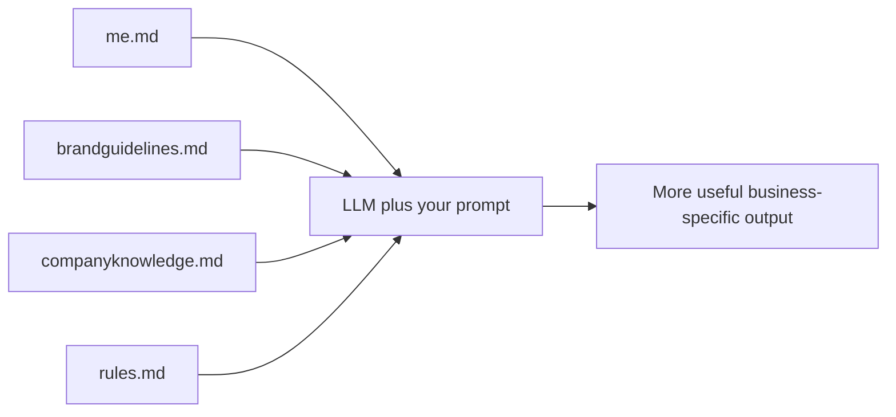

# Workshop-Ready Markdown Templates

## Executive summary

The package below is designed as a copy-and-paste class handout for your AI workshop. It follows the same teaching logic already established in your slide deck: AI gets more useful when it has business context, and the simplest way to provide that context is through four clear files that function like an “AI Employee Handbook.” The deliverable is written for non-technical small business owners, keeps the language plain, and is structured so attendees can fill in the blanks and use the files right away. fileciteturn0file0

## Why these four files work

Your current deck separates context into four roles: who the person is, how the brand sounds, what the company knows, and what rules the AI must follow. That separation is valuable because it makes the files easier to maintain, reduces contradictions, and lets business owners update one part of their context without rewriting everything else. The document below preserves that structure and converts it into practical templates with examples, short and long samples, prompt snippets, and simple upkeep guidance. fileciteturn0file0

## How to demo them in class

The cleanest class demo is the one your deck already points toward: run a generic business prompt with no files attached, show the weak result, then upload the four Markdown files and run the exact same prompt again. That before-and-after sequence makes the lesson visible in seconds: better tone, better specificity, better accuracy, and better alignment to the business. From there, you can naturally transition into your coding preview and DONNA mention as the “what comes next” section of the workshop. fileciteturn0file0

## Concatenated Markdown files

````md
# Executive Summary

These four Markdown files act like a simple AI employee handbook for a small business.

They help an LLM answer with more context by telling it:

- who you are
- how your brand sounds
- what your business knows
- what rules it must follow

The goal is not to make these files perfect. The goal is to make them useful.

Good context files are:

- true
- specific
- easy to update
- written in plain English
- organized so both people and AI can skim them quickly

If you only have a short amount of time, complete these in this order:

1. `me.md`
2. `companyknowledge.md`
3. `brandguidelines.md`
4. `rules.md`

Use short bullet points when possible. Add dates to anything that changes often. If you do not know something yet, say so plainly instead of guessing.



## Instructor Note

Here is the easiest way to present these files in class:

Start with one simple prompt and no files attached. Use something like, “Write a marketing email for my business.” Let the room see how generic the answer feels.

Next, upload all four files and run the exact same prompt again.

Then ask three questions:

- What changed about the tone?
- What changed about the details?
- What changed about the trust level of the answer?

Your teaching point is simple: better prompting helps, but better context helps even more.

A good live sequence is:

1. Show the generic result.
2. Upload `me.md` and rerun.
3. Upload all four files and rerun again.
4. Explain why each file improved the result.
5. End by telling attendees that these files can also help with AI research, customer responses, content, SOPs, and coding tools.

## Five Ready-to-Run Prompts

### Prompt 1

```text
Using the attached me.md, brandguidelines.md, companyknowledge.md, and rules.md, write a friendly and professional follow-up email to a new lead who asked about my services today.

If any information is missing, ask up to 3 clarifying questions before drafting.
```

### Prompt 2

```text
Using the attached me.md, brandguidelines.md, companyknowledge.md, and rules.md, write a one-week social media content plan for my business.

Include:
- 3 educational posts
- 1 promotional post
- 1 trust-building post

Keep the writing aligned to my brand voice and target audience.
```

### Prompt 3

```text
Using the attached me.md, brandguidelines.md, companyknowledge.md, and rules.md, create a homepage draft for my business website.

Include:
- headline
- subheadline
- services overview
- trust section
- call to action

Use plain English and avoid hype.
```

### Prompt 4

```text
Using the attached me.md, brandguidelines.md, companyknowledge.md, and rules.md, answer this customer question as if you were my office manager:

[PASTE CUSTOMER QUESTION]

If the answer depends on missing facts, say what is known, what is unknown, and what needs confirmation.
```

### Prompt 5

```text
Using the attached me.md, brandguidelines.md, companyknowledge.md, and rules.md, turn the notes below into a simple SOP for my team.

[PASTE NOTES]

Format the result with:
- purpose
- owner
- steps
- common mistakes
- escalation path
```
